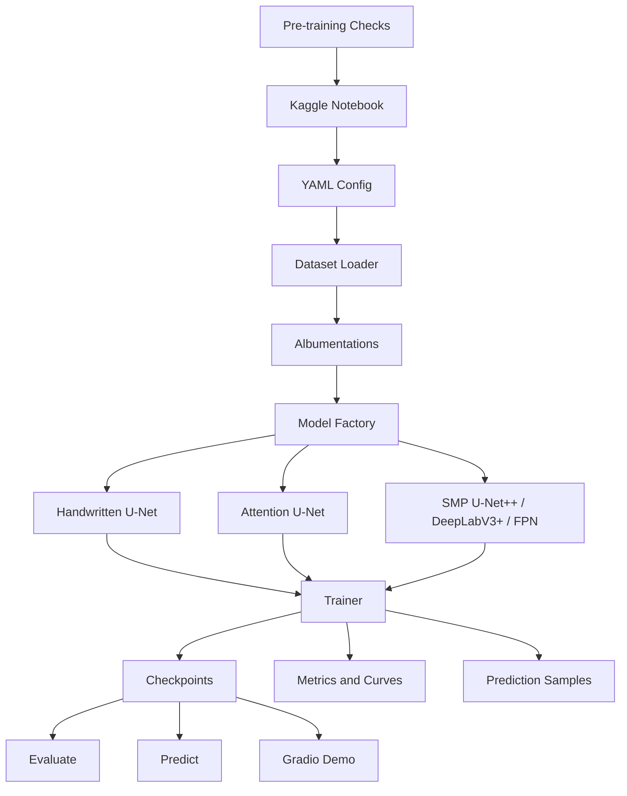

# medical-image-segmentation

**Skin Lesion Segmentation with Improved U-Net Models**  
基于 U-Net 改进模型的皮肤病灶图像分割系统

一句话简介：一个基于 PyTorch 的医学图像二分类分割项目，支持手写 U-Net、Attention U-Net、U-Net++、DeepLabV3+、Kaggle GPU 训练、本地评估预测和 Gradio Web Demo。

## 项目背景

皮肤病灶图像分割是医学图像分析中的典型任务，目标是在皮肤镜图像中定位病灶区域。准确的病灶分割可以为后续分类、面积估计、边界分析和辅助诊断提供基础。本项目围绕 U-Net 及其改进结构，构建一个从数据读取到云端训练、指标评估、结果可视化和本地 Demo 的完整深度学习工程。

## 项目功能

- 读取图像和二值 mask，并按文件名自动匹配。
- 支持 Albumentations 同步数据增强。
- 支持手写 U-Net、Attention U-Net、U-Net++、DeepLabV3+、FPN。
- 支持 ImageNet 预训练 encoder 的高性能分割模型。
- 支持 BCE、Dice、BCE+Dice、Focal、Focal+Dice loss。
- 支持 Dice、IoU、Precision、Recall 评估。
- 支持 CPU/CUDA 自动选择和 CUDA mixed precision。
- 支持 Kaggle 正式训练前质量检查。
- 支持单图预测、评估、结果叠加可视化和 Gradio Demo。

## 系统架构



## 技术栈

- Python 3.10+
- PyTorch
- OpenCV
- Albumentations
- NumPy
- Matplotlib
- scikit-learn
- Gradio
- PyYAML
- pytest
- segmentation-models-pytorch，可选高性能模型依赖

## 项目结构

```text
configs/                 # 本地、Kaggle、对比实验配置
src/                     # 数据集、模型、loss、metrics、训练和可视化模块
scripts/                 # 训练前质量检查脚本
notebooks/               # Kaggle 训练 Notebook
outputs/                 # 指标、曲线、样例图和检查报告
checkpoints/             # best_model.pth / last_model.pth
docs/                    # 实验报告和计划
tests/                   # 单元测试
train.py                 # 训练入口
evaluate.py              # 评估入口
predict.py               # 单图预测入口
app.py                   # Gradio Demo
```

## 安装方法

```bash
python -m venv .venv
source .venv/bin/activate
pip install -r requirements.txt
```

如果只运行手写 U-Net、Attention U-Net 和基础测试，`segmentation-models-pytorch` 可暂时不安装；使用 U-Net++、DeepLabV3+、FPN 时需要安装。

## 数据集准备

推荐目录：

```text
data/
  images/
    train/
    val/
  masks/
    train/
    val/
```

图像和 mask 使用相同文件名 stem 匹配，例如 `ISIC_001.jpg` 匹配 `ISIC_001.png`。所有路径必须写在 YAML 配置中，不要写入源码。

## Kaggle 训练方法

1. 在 Kaggle Notebook 中启用 GPU。
2. 上传或 clone 本项目代码。
3. 添加皮肤病灶 Kaggle Dataset。
4. 打开 `notebooks/kaggle_train.ipynb`。
5. 修改 Notebook 中的数据路径变量。
6. 先运行训练前检查，再正式训练。

也可以直接使用配置文件：

```bash
python train.py --config configs/kaggle_debug.yaml
python train.py --config configs/kaggle_high_accuracy.yaml
```

## 正式训练前检查流程

正式长时间训练前必须运行：

```bash
pytest tests
python scripts/check_dataset.py --config configs/kaggle_debug.yaml
python scripts/overfit_small_batch.py --config configs/kaggle_debug.yaml
python scripts/quick_train.py --config configs/kaggle_debug.yaml
```

检查报告保存到：

```text
outputs/sanity_check/
```

Kaggle 上保存到：

```text
/kaggle/working/outputs/sanity_check/
```

### Dataset Check 正常标准

- image 和 mask 数量一致。
- image 和 mask 能按文件名正确匹配。
- mask 不是全黑或全白。
- 叠加图中 mask 区域和病灶区域大致对齐。

### Small Batch Overfit 正常标准

- loss 明显下降。
- Dice 明显上升。
- 预测 mask 逐渐接近真实 mask。
- 如果 overfit 失败，不要进行正式训练。

### Quick Train 正常标准

- 训练不报错。
- 指标不是 NaN。
- loss 没有爆炸。
- 预测图不是全黑或全白。

## 高准确率训练配置

手写 U-Net 用于理解原理；Attention U-Net 用于展示改进结构；U-Net++ / DeepLabV3+ + pretrained encoder 用于追求更高 Dice 和 IoU。

推荐正式配置见 `configs/kaggle_high_accuracy.yaml`：

```yaml
model_name: unet_plus_plus
encoder_name: efficientnet-b3
encoder_weights: imagenet
image_size: 384
batch_size: 8
epochs: 50
lr: 1e-4
optimizer: adamw
scheduler: cosine
loss_name: bce_dice
augmentation.enabled: true
device: auto
mixed_precision: true
early_stopping.enabled: true
early_stopping.patience: 10
early_stopping.monitor: val_dice
early_stopping.mode: max
```

Kaggle 上正式训练建议使用 `configs/kaggle_high_accuracy.yaml` 或 Notebook 生成的 high accuracy runtime config。

## 本地运行方法

本地主要用于预测、评估、Gradio Demo 和小规模调试。没有 GPU 时自动使用 CPU。

```bash
python scripts/check_dataset.py --config configs/debug_local.yaml
python scripts/quick_train.py --config configs/debug_local.yaml
```

## 训练命令

```bash
python train.py --config configs/unet.yaml
python train.py --config configs/attention_unet.yaml
python train.py --config configs/unetplusplus.yaml
python train.py --config configs/deeplabv3plus.yaml
```

## 评估方法

```bash
python evaluate.py --config configs/unet.yaml --checkpoint checkpoints/best_model.pth
```

输出 Dice、IoU、Precision、Recall 和平均 loss，并保存到 `outputs/metrics.csv`。

## 单图预测方法

```bash
python predict.py \
  --image path/to/image.jpg \
  --checkpoint checkpoints/best_model.pth \
  --config configs/unet.yaml \
  --output outputs/samples \
  --threshold 0.5 \
  --device auto
```

## Gradio Demo 运行方法

```bash
python app.py
```

Demo 支持上传图像、选择 checkpoint、config、模型类型、threshold 和 device，输出原图、预测 mask、叠加图、病灶面积比例和推理时间。

## 实验设计

- 模型对比：U-Net、Attention U-Net、U-Net++、DeepLabV3+。
- Loss 对比：BCE、Dice、BCE+Dice。
- 数据增强对比：开启增强 vs 关闭增强。
- 输入尺寸对比：256 vs 384。
- 训练环境对比：Kaggle GPU 正式训练，本地 CPU/CUDA 推理。

## 实验结果表格占位

| Experiment | Model | Loss | Image Size | Dice | IoU | Precision | Recall |
| --- | --- | --- | --- | --- | --- | --- | --- |
| 待填入实验结果 | U-Net | BCE+Dice | 256 | 待填入 | 待填入 | 待填入 | 待填入 |
| 待填入实验结果 | Attention U-Net | BCE+Dice | 256 | 待填入 | 待填入 | 待填入 | 待填入 |
| 待填入实验结果 | U-Net++ | BCE+Dice | 384 | 待填入 | 待填入 | 待填入 | 待填入 |

## 可视化结果占位

训练完成后，将以下内容放入 README 或报告：

- 原图
- 真实 mask
- 预测 mask
- 预测叠加图
- loss / Dice / IoU 曲线

## 项目亮点

- 工程流程完整，覆盖数据、模型、训练、评估、可视化和 Demo。
- 同时包含手写模型和预训练高性能模型。
- 支持 Kaggle 云训练和本地 CPU/CUDA 推理。
- 加入正式长训练前质量检查，降低 Kaggle 白跑风险。
- 所有数据路径通过 YAML 或命令行传入，便于迁移和复现实验。

## 局限性

- 真实效果依赖数据集质量、标注一致性和训练时长。
- 当前默认任务为二分类分割，未覆盖多类别病灶分割。
- 没有内置医学临床验证流程，结果仅用于课程项目和算法展示。

## 未来改进

- 加入交叉验证和更多 encoder 对比。
- 增加测试集独立评估和置信区间统计。
- 支持模型导出 ONNX。
- 增加 Grad-CAM 或不确定性可视化。
- 优化 Gradio Demo 的批量预测能力。
