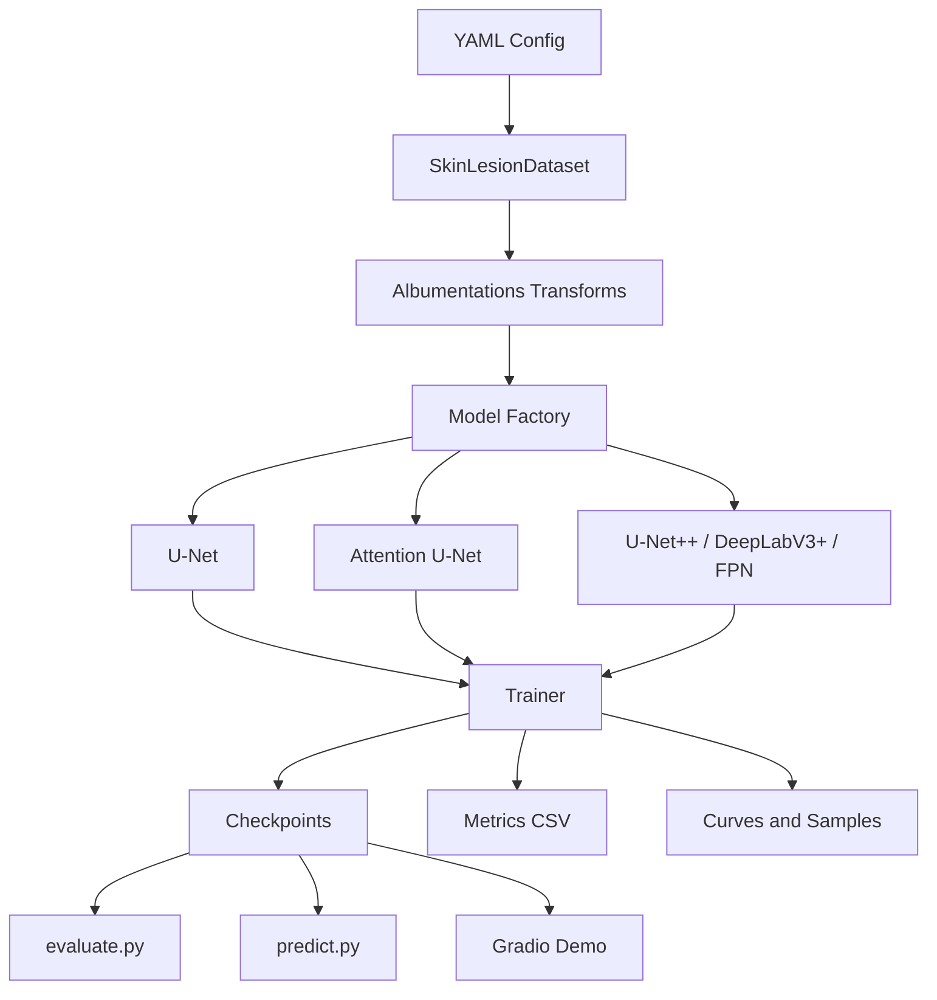

# Medical Image Segmentation

**English:** Skin lesion segmentation with improved U-Net models.  
**中文：** 基于 U-Net 改进模型的皮肤病灶图像分割系统。

This repository implements a PyTorch-based binary medical image segmentation pipeline for skin lesion images. It supports U-Net, Attention U-Net, U-Net++, DeepLabV3+, Kaggle GPU training, local CPU/CUDA inference, metric evaluation, prediction visualization, and a Gradio Web Demo.

本项目实现了一个基于 PyTorch 的皮肤病灶二分类医学图像分割流程，支持 U-Net、Attention U-Net、U-Net++、DeepLabV3+、Kaggle GPU 训练、本地 CPU/CUDA 推理、指标评估、预测可视化和 Gradio Web Demo。

## Overview / 项目概述

The task is pixel-level binary segmentation. Given an RGB skin lesion image, the model predicts a one-channel lesion mask. Models output logits; sigmoid and thresholding are applied only during metrics and inference.

本任务是像素级二分类分割。输入为 RGB 皮肤病灶图像，输出为单通道病灶 mask。所有模型输出 logits，只有在指标计算和推理阶段才执行 sigmoid 和 threshold。

The final default inference model is:

最终默认推理模型为：

```text
U-Net++ + EfficientNet-B3 encoder
Checkpoint: checkpoints/best_model.pth
Config: configs/final_model.yaml
```

## Features / 功能

- Binary skin lesion segmentation / 皮肤病灶二分类分割
- Handwritten U-Net baseline / 手写 U-Net 基线模型
- Attention U-Net / Attention U-Net 改进结构
- U-Net++ and DeepLabV3+ high-accuracy models / U-Net++ 与 DeepLabV3+ 高精度模型
- Kaggle GPU training workflow / Kaggle GPU 训练流程
- CPU/CUDA automatic local inference / 本地 CPU/CUDA 自动选择
- Dice, IoU, Precision, Recall evaluation / Dice、IoU、Precision、Recall 评估
- Prediction visualization with masks and overlays / mask 与叠加图可视化
- Gradio Web Demo / Gradio Web 演示
- Training sanity checks / 训练前质量检查

## Project Structure / 项目结构

```text
configs/                 YAML configs for local and Kaggle runs
src/                     Dataset, models, losses, metrics, trainer, visualization
scripts/                 Dataset check, small-batch overfit, quick train
notebooks/               Kaggle training notebook
docs/                    Technical report and experiment documents
outputs/                 Local outputs, curves, samples, sanity checks
checkpoints/             Model checkpoints
tests/                   Unit tests independent of real datasets
train.py                 Training entry point
evaluate.py              Evaluation entry point
predict.py               Single-image prediction
app.py                   Gradio Web Demo
```

## System Architecture / 系统架构



## Environment Setup / 环境配置

Python 3.10+ is recommended.

推荐使用 Python 3.10+。

```bash
python -m venv .venv
source .venv/bin/activate
pip install -r requirements.txt
```

`requirements.txt` already includes the dependency for the final U-Net++ model. If you use a minimal environment, install it manually:

`requirements.txt` 已包含最终 U-Net++ 模型所需依赖。若使用精简环境，可手动安装：

```bash
pip install segmentation-models-pytorch
```

Run tests:

运行测试：

```bash
pytest tests
```

## Dataset Format / 数据集格式

Images and masks must share the same filename stem.

图像和 mask 必须使用相同文件名 stem。

```text
data/
  images/
    train/
      ISIC_0000001.jpg
    val/
      ISIC_0000002.jpg
  masks/
    train/
      ISIC_0000001.png
    val/
      ISIC_0000002.png
```

All dataset paths are passed through YAML configs or command-line arguments. Source code does not hard-code local or Kaggle data paths.

所有数据路径均通过 YAML 配置或命令行参数传入，源码不硬编码本地或 Kaggle 数据路径。

## Kaggle Training / Kaggle 训练

Training was completed in a Kaggle GPU environment. The high-accuracy run used Tesla P100 with a PyTorch CUDA compatibility preparation step.

训练已在 Kaggle GPU 环境完成。高精度训练使用 Tesla P100，并通过兼容性脚本处理 PyTorch CUDA 运行问题。

Kaggle dependency preparation:

Kaggle 依赖准备：

```bash
pip install -r requirements-kaggle.txt
python scripts/kaggle_prepare_gpu.py --install-if-needed
```

Pre-training checks:

训练前检查：

```bash
pytest tests
python scripts/check_dataset.py --config configs/kaggle_debug.yaml
python scripts/overfit_small_batch.py --config configs/kaggle_debug.yaml
python scripts/quick_train.py --config configs/kaggle_debug.yaml
```

Baseline training:

基线模型训练：

```bash
python train.py --config configs/kaggle_unet.yaml
```

High-accuracy training:

高精度模型训练：

```bash
python train.py --config configs/kaggle_high_accuracy.yaml
```

## Local Inference / 本地推理

The final default model files are:

最终默认模型文件：

```text
Checkpoint: checkpoints/best_model.pth
Config: configs/final_model.yaml
```

Model checkpoint files (`*.pth`, `*.pt`, `*.ckpt`) are intentionally excluded from Git. Download `best_model.pth` from the Kaggle output or a project release, then place it at `checkpoints/best_model.pth` before running local inference.

模型权重文件（`*.pth`、`*.pt`、`*.ckpt`）不会提交到 Git。请从 Kaggle 输出或项目 Release 下载 `best_model.pth`，并放到 `checkpoints/best_model.pth` 后再进行本地推理。

Single-image prediction:

单图预测：

```bash
python predict.py \
  --config configs/final_model.yaml \
  --checkpoint checkpoints/best_model.pth \
  --image path/to/image.jpg \
  --output outputs/samples \
  --threshold 0.5 \
  --device auto
```

Gradio Demo:

Gradio 演示：

```bash
python app.py
```

The project supports CPU/CUDA automatic device selection. If CUDA is unavailable, local prediction and the Gradio Demo run on CPU.

项目支持 CPU/CUDA 自动选择。若 CUDA 不可用，本地预测和 Gradio Demo 会使用 CPU。

## Evaluation / 评估

Evaluation command:

评估命令：

```bash
python evaluate.py --config configs/final_model.yaml --checkpoint checkpoints/best_model.pth
```

Metrics:

指标含义：

- Dice: overlap between predicted mask and ground truth.
- IoU: intersection-over-union of predicted and ground-truth masks.
- Precision: proportion of predicted lesion pixels that are correct.
- Recall: proportion of ground-truth lesion pixels recovered by prediction.

## Results / 实验结果

The following results are read from:

以下结果来自：

```text
kaggle_outputs/baseline_unet/outputs/experiment_results.csv
kaggle_outputs/high_accuracy/outputs/experiment_results.csv
```

The full Kaggle outputs are kept outside Git tracking. A small set of representative curves, prediction samples, and sanity-check images is stored under `docs/assets/` for repository documentation.

完整 Kaggle 输出不纳入 Git 跟踪。仓库文档使用 `docs/assets/` 中的少量代表性曲线、预测样例和数据检查图。

| Experiment | Model | Encoder | Image Size | Batch Size | Best Epoch | Loss | Best Val Loss | Dice | IoU | Precision | Recall | Training Time | Inference Time |
| --- | --- | --- | ---: | ---: | ---: | --- | ---: | ---: | ---: | ---: | ---: | --- | --- |
| U-Net baseline | U-Net | None | 256 | 8 | 27 | BCE + Dice | 0.186221 | 0.839209 | 0.749852 | 0.904178 | 0.836919 | 11m 54s | Not available |
| High accuracy model | U-Net++ | EfficientNet-B3, ImageNet | 384 | 8 | 4 | BCE + Dice | 0.153719 | 0.872120 | 0.792033 | 0.905242 | 0.881161 | 18m 26s | Not available |

Metric improvement of the high-accuracy model over baseline:

高精度模型相对 baseline 的提升：

| Metric | Baseline | High Accuracy | Difference |
| --- | ---: | ---: | ---: |
| Dice | 0.839209 | 0.872120 | +0.032911 |
| IoU | 0.749852 | 0.792033 | +0.042181 |
| Precision | 0.904178 | 0.905242 | +0.001064 |
| Recall | 0.836919 | 0.881161 | +0.044241 |

## Visualization / 可视化结果

Training curves:

训练曲线：

```text
docs/assets/results/baseline_unet_training_curves.png
docs/assets/results/high_accuracy_training_curves.png
```


Prediction samples:

预测样例：

```text
docs/assets/samples/baseline_unet/sample_000_overlay.png
docs/assets/samples/baseline_unet/sample_001_overlay.png
docs/assets/samples/high_accuracy/sample_000_overlay.png
docs/assets/samples/high_accuracy/sample_001_overlay.png
```


Sanity check report:

数据检查报告：

```text
docs/assets/sanity_check/dataset_check_report.md
docs/assets/sanity_check/dataset_overlay_00.png
docs/assets/sanity_check/dataset_overlay_01.png
```

High-accuracy dataset check summary:

高精度训练数据检查摘要：

```text
Train images/masks: 2000 / 2000
Val images/masks: 150 / 150
Invalid binary masks: 0
Image/mask size mismatches: 0
Mean foreground ratio: 0.192484
All-black/all-white masks: none reported
```

## Model Selection / 模型选择

The final default model is the high-accuracy U-Net++ model with an EfficientNet-B3 encoder. It provides higher Dice, IoU, and Recall than the U-Net baseline while keeping Precision at a similar level.

最终默认模型采用 U-Net++ + EfficientNet-B3。该模型在 Dice、IoU 和 Recall 上均优于 U-Net baseline，同时 Precision 基本保持一致。

Use:

使用：

```text
configs/final_model.yaml
checkpoints/best_model.pth
```

## Limitations / 局限性

- Current reported metrics are based on the available Kaggle validation split.
- Inference time was not persisted in the Kaggle output files and is therefore reported as `Not available`.
- The high-accuracy model shows mild overfitting after the best epoch.
- The current visualization overlays predicted masks only; true masks are saved separately.
- No independent external test set evaluation is included in the current outputs.

## Future Work / 后续改进

- Add external test set evaluation and cross-validation.
- Compare additional encoders such as EfficientNet-B4, ResNet50, and ConvNeXt variants.
- Evaluate Focal + Dice loss for small-lesion recall.
- Add post-processing options for boundary smoothing or small false-positive removal.
- Export ONNX or TorchScript models for deployment.
- Add batch prediction and structured report export.
