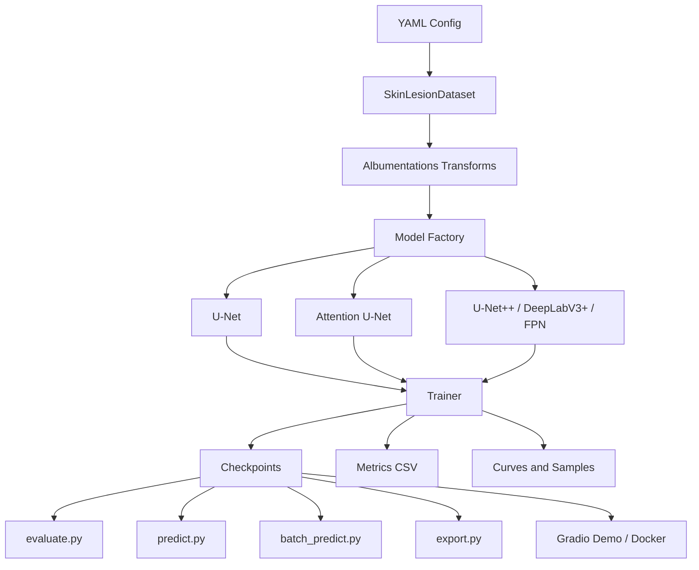
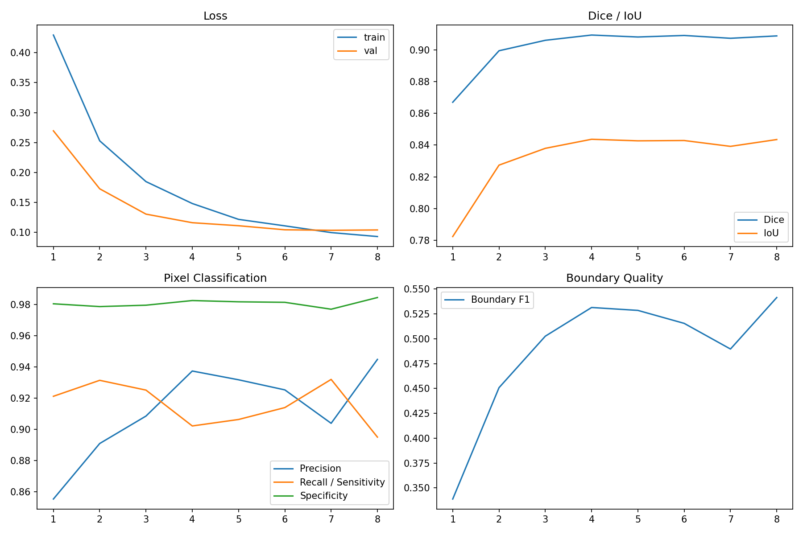
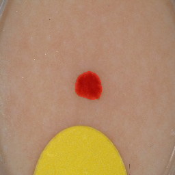
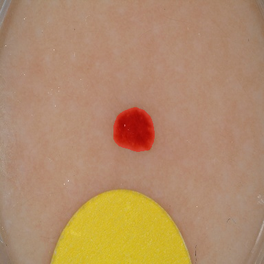
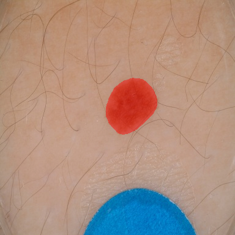
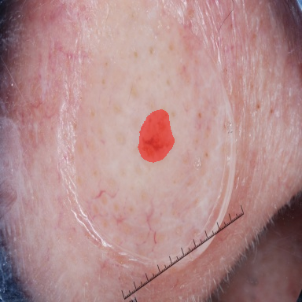
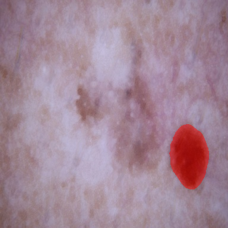

# Medical Image Segmentation

[](https://github.com/dongtingshuo/medical-image-segmentation/actions/workflows/ci.yml)
[](https://github.com/dongtingshuo/medical-image-segmentation/releases/latest)
[](LICENSE)

**English:** Skin lesion segmentation with improved U-Net models.  
**中文：** 基于 U-Net 改进模型的皮肤病灶图像分割系统。

This repository implements a PyTorch-based binary medical image segmentation pipeline for skin lesion images. It supports U-Net, Attention U-Net, U-Net++, DeepLabV3+, Kaggle GPU training, local CPU/CUDA inference, batch prediction, metric evaluation, prediction visualization, ONNX/TorchScript export, Docker deployment, and a Gradio Web Demo.

本项目实现了一个基于 PyTorch 的皮肤病灶二分类医学图像分割流程，支持 U-Net、Attention U-Net、U-Net++、DeepLabV3+、Kaggle GPU 训练、本地 CPU/CUDA 推理、批量预测、指标评估、预测可视化、ONNX/TorchScript 导出、Docker 部署和 Gradio Web Demo。

## Overview / 项目概述

The task is pixel-level binary segmentation. Given an RGB skin lesion image, the model predicts a one-channel lesion mask. Models output logits; sigmoid and thresholding are applied only during metrics and inference.

本任务是像素级二分类分割。输入为 RGB 皮肤病灶图像，输出为单通道病灶 mask。所有模型输出 logits，只有在指标计算和推理阶段才执行 sigmoid 和 threshold。

The final default inference model is:

最终默认推理模型为：

```text
U-Net++ + EfficientNet-B3 encoder
Checkpoint: checkpoints/best_model.pth
Config: configs/final_model.yaml
```

## Features / 功能

- Binary skin lesion segmentation / 皮肤病灶二分类分割
- Handwritten U-Net baseline / 手写 U-Net 基线模型
- Attention U-Net / Attention U-Net 改进结构
- U-Net++ and DeepLabV3+ high-accuracy models / U-Net++ 与 DeepLabV3+ 高精度模型
- Kaggle GPU training workflow / Kaggle GPU 训练流程
- CPU/CUDA automatic local inference / 本地 CPU/CUDA 自动选择
- Dice, IoU, Precision, Recall, Specificity, and Boundary F1 evaluation / Dice、IoU、Precision、Recall、Specificity 与 Boundary F1 评估
- Model comparison and loss comparison / 模型对比与损失函数对比
- Prediction visualization with masks and overlays / mask 与叠加图可视化
- Single-image and batch prediction with CSV reports / 单图预测与批量预测 CSV 报告
- Overlay visualization and false-positive/false-negative maps / 叠加可视化与误检、漏检图
- ONNX and TorchScript export with manifest and SHA256 checksums / ONNX 与 TorchScript 导出，包含 manifest 和 SHA256 校验
- Dockerized CPU demo runtime / Docker CPU demo 运行环境
- Segmentation error analysis / 分割错误分析
- Cross-validation, encoder comparison, subgroup analysis, and statistical summaries / 交叉验证、encoder 对比、子组分析和统计汇总
- Low-contrast specialist v1.3 workflow / 低对比度专项 v1.3 流程
- Lightweight toy segmentation demo / 轻量分割演示
- Gradio Web Demo / Gradio Web 演示
- Training sanity checks / 训练前质量检查
- Medical disclaimer for non-clinical use / 非临床用途医学免责声明

## Project Structure / 项目结构

```text
configs/                 YAML configs for local and Kaggle runs
src/                     Dataset, models, losses, metrics, trainer, visualization
scripts/                 Dataset checks, training helpers, research analysis, packaging
notebooks/               Kaggle training and research scripts/notebook
docs/                    Technical report and experiment documents
models/                  Versioned model manifest and artifact metadata
outputs/                 Local outputs, curves, samples, sanity checks
checkpoints/             Model checkpoints
tests/                   Unit tests independent of real datasets
train.py                 Training entry point
evaluate.py              Evaluation entry point
predict.py               Single-image prediction
batch_predict.py         Directory-level batch prediction and CSV report
export.py                ONNX and TorchScript export
app.py                   Gradio Web Demo
Dockerfile               Containerized Gradio runtime
```

## Documentation / 文档

English:
The main project documents describe training, evaluation, result interpretation, and lightweight reproducible demos.

中文：
主要文档说明训练、评估、结果解释和轻量可复现实验 demo。

- [docs/report.md](docs/report.md)
- [docs/EXPERIMENT_REPORT.md](docs/EXPERIMENT_REPORT.md)
- [FINAL_GUIDE.md](FINAL_GUIDE.md)
- [DATASET.md](DATASET.md)
- [MODEL_CARD.md](MODEL_CARD.md)
- [CONTRIBUTING.md](CONTRIBUTING.md)
- [SECURITY.md](SECURITY.md)
- [CHANGELOG.md](CHANGELOG.md)
- [docs/releases/v1.1.0.md](docs/releases/v1.1.0.md)
- [docs/releases/v1.2.0.md](docs/releases/v1.2.0.md)
- [docs/releases/v1.3.0.md](docs/releases/v1.3.0.md)
- [examples/toy_segmentation_demo/README.md](examples/toy_segmentation_demo/README.md)

## System Architecture / 系统架构



## Environment Setup / 环境配置

Python 3.10-3.12 is supported. Direct dependencies are pinned for reproducible installation.

支持 Python 3.10-3.12，直接依赖已锁定版本，用于可重复安装。

```bash
python -m venv .venv
source .venv/bin/activate
python -m pip install -r requirements.txt
```

`requirements.txt` already includes the dependency for the final U-Net++ model. If you use a minimal environment, install it manually:

`requirements.txt` 已包含最终 U-Net++ 模型所需依赖。若使用精简环境，可手动安装：

```bash
pip install segmentation-models-pytorch
```

Run tests:

运行测试：

```bash
python -m pytest -q
```

GitHub Actions runs the CPU test suite and command-line smoke tests on Python 3.10 and 3.12. Training uses deterministic algorithms and seeded DataLoader workers by default; set `reproducibility.deterministic: false` only when throughput is more important than exact repeatability.

GitHub Actions 会在 Python 3.10 和 3.12 上执行 CPU 测试与命令行检查。训练默认启用确定性算法和 DataLoader worker 随机种子；只有在吞吐量优先时才建议设置 `reproducibility.deterministic: false`。

## Quick Demo / 快速演示

English:
The quick demo uses synthetic toy data and runs on CPU. It validates the experiment workflow without downloading large datasets or model weights.

中文：
快速演示使用合成 toy 数据，可在 CPU 上运行，用于验证实验流程，不下载大型数据集或模型权重。

Generate toy data:

生成 toy 数据：

```bash
python scripts/create_toy_segmentation_data.py
```

Run model and loss comparison:

运行模型和损失函数对比：

```bash
python scripts/run_segmentation_comparison.py --config configs/demo_comparison.yaml
```

Run visualization demo:

运行可视化 demo：

```bash
python scripts/run_visualization_demo.py
```

Run error analysis demo:

运行错误分析 demo：

```bash
python scripts/run_error_analysis.py
```

## Dataset Format / 数据集格式

Images and masks must share the same filename stem.

图像和 mask 必须使用相同文件名 stem。

```text
data/
  images/
    train/
      ISIC_0000001.jpg
    val/
      ISIC_0000002.jpg
  masks/
    train/
      ISIC_0000001.png
    val/
      ISIC_0000002.png
```

All dataset paths are passed through YAML configs or command-line arguments. Source code does not hard-code local or Kaggle data paths.

所有数据路径均通过 YAML 配置或命令行参数传入，源码不硬编码本地或 Kaggle 数据路径。

The reported experiments use the ISIC 2017 train/validation segmentation split through a Kaggle mirror. Dataset provenance, split counts, licensing boundaries, and validation status are documented in [DATASET.md](DATASET.md). The medical dataset is not redistributed by this repository.

已报告实验使用 Kaggle 镜像中的 ISIC 2017 train/validation 分割数据。数据来源、划分数量、授权边界和评估状态详见 [DATASET.md](DATASET.md)。本仓库不再分发医疗数据。

## Kaggle Training / Kaggle 训练

Training was completed in a Kaggle GPU environment. The high-accuracy run used Tesla P100 with a PyTorch CUDA compatibility preparation step.

训练已在 Kaggle GPU 环境完成。高精度训练使用 Tesla P100，并通过兼容性脚本处理 PyTorch CUDA 运行问题。

Kaggle dependency preparation:

Kaggle 依赖准备：

```bash
pip install -r requirements-kaggle.txt
python scripts/kaggle_prepare_gpu.py --install-if-needed
```

Pre-training checks:

训练前检查：

```bash
python -m pytest -q
python scripts/check_dataset.py --config configs/kaggle_debug.yaml
python scripts/overfit_small_batch.py --config configs/kaggle_debug.yaml
python scripts/quick_train.py --config configs/kaggle_debug.yaml
```

Baseline training:

基线模型训练：

```bash
python train.py --config configs/kaggle_unet.yaml
```

High-accuracy training:

高精度模型训练：

```bash
python train.py --config configs/kaggle_high_accuracy.yaml
```

Resume interrupted training:

断点续训：

```bash
python train.py \
  --config configs/kaggle_high_accuracy.yaml \
  --resume /kaggle/working/checkpoints/last_model.pth
```

Training checkpoints save model, optimizer, scheduler, AMP scaler, metrics history, best score, best epoch, and early-stopping state. Use `last_model.pth` for resume and `best_model.pth` for evaluation or inference.

训练 checkpoint 会保存模型、optimizer、scheduler、AMP scaler、指标历史、最佳分数、最佳 epoch 和 early-stopping 状态。断点续训使用 `last_model.pth`，评估或推理使用 `best_model.pth`。

## Research Workflow v1.2 / 研究增强流程 v1.2

English:
Version 1.2 adds a Kaggle-oriented research workflow for small-budget robustness analysis. The workflow has been executed on Kaggle GPU and is reported as robustness evidence. It does not replace the current default inference checkpoint.

中文：
v1.2 新增面向 Kaggle 的小预算研究增强流程，用于稳健性分析。该流程已在 Kaggle GPU 上完成运行，并作为稳健性证据报告；它不替换当前默认推理 checkpoint。

Core commands:

核心命令：

```bash
python scripts/create_cv_folds.py \
  --images-dir /path/to/images \
  --masks-dir /path/to/masks \
  --output-root outputs/cross_validation \
  --k 3 \
  --materialize

python scripts/run_cross_validation.py \
  --config configs/kaggle_research_v1_2.yaml \
  --images-dir /kaggle/working/prepared_data/internal/trainval/images \
  --masks-dir /kaggle/working/prepared_data/internal/trainval/masks \
  --output-root /kaggle/working/research_v1_2/cross_validation \
  --k 3

python scripts/run_encoder_comparison.py \
  --config configs/kaggle_research_v1_2.yaml \
  --output-root /kaggle/working/research_v1_2/encoder_comparison \
  --encoders efficientnet-b3 resnet34

python scripts/analyze_subgroups.py \
  --config /path/to/best_runtime_config.yaml \
  --checkpoint /path/to/best_model.pth \
  --split test \
  --threshold 0.35

python scripts/analyze_statistics.py \
  --inputs /path/to/metrics.csv \
  --output-dir outputs/statistical_analysis
```

Kaggle full research script:

Kaggle 完整研究脚本：

```bash
python notebooks/kaggle_research_v1_2.py
```

Completed v1.2 outputs include `cross_validation_summary.md`, `encoder_comparison_summary.md`, subgroup CSV/Markdown reports, statistical CI reports, and a sanitized release artifact package. The sanitized package excludes materialized fold data and medical image files.

v1.2 已完成输出包括 `cross_validation_summary.md`、`encoder_comparison_summary.md`、子组 CSV/Markdown 报告、统计置信区间报告和经过清理的 Release 产物包。清理后的产物包不包含 materialized fold data 或医学图像文件。

Research artifact:

研究产物：

```text
release_artifacts/medical-segmentation-research-artifacts-v1.2.zip
SHA256: 68f8d417d8df21434666f6cfd438c0972a9849ebd6801b275cfbc4e7ab131843
```

## Local Inference / 本地推理

The final default model files are:

最终默认模型文件：

```text
Checkpoint: checkpoints/best_model.pth
Config: configs/final_model.yaml
```

Model checkpoint files (`*.pth`, `*.pt`, `*.ckpt`) are intentionally excluded from Git. Download `best_model.pth` from the Kaggle output or a project release, then place it at `checkpoints/best_model.pth` before running local inference.

模型权重文件（`*.pth`、`*.pt`、`*.ckpt`）不会提交到 Git。请从 Kaggle 输出或项目 Release 下载 `best_model.pth`，并放到 `checkpoints/best_model.pth` 后再进行本地推理。

Verified Release / 已验证 Release：

```bash
mkdir -p checkpoints
curl -L \
  https://github.com/dongtingshuo/medical-image-segmentation/releases/download/v1.0.0/best_model.pth \
  -o checkpoints/best_model.pth
shasum -a 256 checkpoints/best_model.pth
```

Expected SHA256 / 期望校验值：

```text
4b04ccd5f4fbdad492a91ea9866d31b9329a886e74464ddf42fffa1854f76577
```

Experiment artifact release / 实验产物 Release：

The `v1.1.0` release provides a reproducibility artifact package with repeated-seed metrics, independent test and external-validation results, CPU/CUDA benchmark reports, threshold-search outputs, failure-case reports, and representative overlays.

`v1.1.0` Release 提供可复现实验产物包，包含 repeated-seed 指标、独立测试集与外部验证集结果、CPU/CUDA benchmark、阈值搜索、失败案例分析和代表性 overlay 图。

```bash
curl -L \
  https://github.com/dongtingshuo/medical-image-segmentation/releases/download/v1.1.0/medical-segmentation-experiment-artifacts-v1.1.zip \
  -o medical-segmentation-experiment-artifacts-v1.1.zip
curl -L \
  https://github.com/dongtingshuo/medical-image-segmentation/releases/download/v1.1.0/medical-segmentation-experiment-artifacts-v1.1.zip.sha256 \
  -o medical-segmentation-experiment-artifacts-v1.1.zip.sha256
shasum -a 256 medical-segmentation-experiment-artifacts-v1.1.zip
```

Expected artifact SHA256 / 实验产物期望校验值：

```text
e414fe14bd835217241462a5e653ccf0c67ffe6a739c20c1fb02ba1f0a1a0c3c
```

See [MODEL_CARD.md](MODEL_CARD.md) and [models/model_manifest.yaml](models/model_manifest.yaml) for model scope and machine-readable metadata. Checkpoints are loaded with PyTorch `weights_only=True`; do not use untrusted weight files.

模型适用范围和机器可读元数据见 [MODEL_CARD.md](MODEL_CARD.md) 与 [models/model_manifest.yaml](models/model_manifest.yaml)。checkpoint 使用 PyTorch `weights_only=True` 加载，请勿使用来源不可信的权重文件。

Single-image prediction:

单图预测：

```bash
python predict.py \
  --config configs/final_model.yaml \
  --checkpoint checkpoints/best_model.pth \
  --image path/to/image.jpg \
  --output outputs/samples \
  --device auto
```

Batch prediction:

批量预测：

```bash
python batch_predict.py \
  --config configs/final_model.yaml \
  --checkpoint checkpoints/best_model.pth \
  --input-dir path/to/images \
  --output outputs/batch_predictions \
  --device auto
```

Batch prediction writes resized images, predicted masks, overlays, lesion area ratios, `batch_predictions.csv`, and `batch_summary.json`.

批量预测会输出 resize 后原图、预测 mask、overlay、病灶面积比例、`batch_predictions.csv` 和 `batch_summary.json`。

Model export:

模型导出：

```bash
python export.py \
  --config configs/final_model.yaml \
  --checkpoint checkpoints/best_model.pth \
  --output-dir exports/final_model \
  --formats torchscript,onnx \
  --device cpu
```

Exported models output logits. Apply sigmoid and thresholding in the serving layer.

导出的模型输出 logits。部署服务层需要自行执行 sigmoid 和 threshold。

Gradio Demo:

Gradio 演示：

```bash
python app.py
```

The project supports CPU/CUDA automatic device selection. If CUDA is unavailable, local prediction and the Gradio Demo run on CPU.

项目支持 CPU/CUDA 自动选择。若 CUDA 不可用，本地预测和 Gradio Demo 会使用 CPU。

Docker CPU demo:

Docker CPU 演示：

```bash
docker build -t medical-image-segmentation .
docker run --rm -p 7860:7860 \
  -v "$PWD/checkpoints:/app/checkpoints" \
  medical-image-segmentation
```

Then open `http://localhost:7860`. Place `best_model.pth` in `checkpoints/` before starting the container.

然后打开 `http://localhost:7860`。启动容器前请先将 `best_model.pth` 放入 `checkpoints/`。

## Evaluation / 评估

Evaluation command:

评估命令：

```bash
python evaluate.py \
  --config configs/final_model.yaml \
  --checkpoint checkpoints/best_model.pth \
  --split val \
  --threshold 0.35
```

Metrics:

指标含义：

- Dice: overlap between predicted mask and ground truth.
- IoU: intersection-over-union of predicted and ground-truth masks.
- Precision: proportion of predicted lesion pixels that are correct.
- Recall: proportion of ground-truth lesion pixels recovered by prediction.
- Specificity: proportion of background pixels correctly rejected.
- Boundary F1: boundary agreement within a configurable pixel tolerance.

`evaluate.py --split test` is supported when `test_images_dir` and `test_masks_dir` are explicitly defined in the YAML config. The repeated evaluation workflow now reports an ISIC 2017 independent test split and an ISIC 2018 external validation split.

当 YAML 明确定义 `test_images_dir` 和 `test_masks_dir` 时，可使用 `evaluate.py --split test`。重复实验流程已报告 ISIC 2017 独立测试集和 ISIC 2018 外部验证集结果。

## Results / 实验结果

The historical single-run results are read from:

历史单次训练结果来自：

```text
kaggle_outputs/baseline_unet/outputs/experiment_results.csv
kaggle_outputs/high_accuracy/outputs/experiment_results.csv
kaggle_outputs/repeated_experiment/repeated_experiments/summary.csv
kaggle_outputs/repeated_experiment/repeated_experiments/all_seed_metrics.csv
kaggle_outputs/repeated_experiment/repeated_experiments/benchmark/benchmark.csv
kaggle_outputs/posthoc_analysis/posthoc_analysis/threshold_search/threshold_search.csv
kaggle_outputs/posthoc_analysis/posthoc_analysis/failure_cases_test/failure_cases.csv
kaggle_outputs/posthoc_analysis/posthoc_analysis/failure_cases_external/failure_cases.csv
kaggle_outputs/research_v1_2/medical-segmentation-research-artifacts-v1.2/research_v1_2/
```

The full Kaggle outputs are kept outside Git tracking. A small set of representative curves, prediction samples, and sanity-check images is stored under `docs/assets/` for repository documentation.

完整 Kaggle 输出不纳入 Git 跟踪。仓库文档使用 `docs/assets/` 中的少量代表性曲线、预测样例和数据检查图。

| Experiment | Model | Encoder | Image Size | Batch Size | Best Epoch | Loss | Val Loss at Best Dice Epoch | Dice | IoU | Precision | Recall | Training Time | Inference Time |
| --- | --- | --- | ---: | ---: | ---: | --- | ---: | ---: | ---: | ---: | ---: | --- | --- |
| U-Net baseline | U-Net | None | 256 | 8 | 27 | BCE + Dice | 0.186221 | 0.839209 | 0.749852 | 0.904178 | 0.836919 | 11m 54s | Not available |
| High accuracy model | U-Net++ | EfficientNet-B3, ImageNet | 384 | 8 | 4 | BCE + Dice | 0.153719 | 0.872120 | 0.792033 | 0.905242 | 0.881161 | 18m 26s | Not available |

Metric improvement of the high-accuracy model over baseline:

高精度模型相对 baseline 的提升：

| Metric | Baseline | High Accuracy | Difference |
| --- | ---: | ---: | ---: |
| Dice | 0.839209 | 0.872120 | +0.032911 |
| IoU | 0.749852 | 0.792033 | +0.042181 |
| Precision | 0.904178 | 0.905242 | +0.001064 |
| Recall | 0.836919 | 0.881161 | +0.044241 |

### Repeated Evaluation / 重复实验评估

The repeated workflow trained the high-accuracy U-Net++ EfficientNet-B3 configuration with three random seeds (`42`, `123`, `2026`) on Kaggle GPU. It evaluates validation, independent ISIC 2017 test, and external ISIC 2018 splits. Mean and standard deviation use sample standard deviation over the three runs.

重复实验在 Kaggle GPU 上使用三个随机种子（`42`、`123`、`2026`）训练高精度 U-Net++ EfficientNet-B3 配置，并评估验证集、ISIC 2017 独立测试集和 ISIC 2018 外部验证集。均值和标准差基于三次运行的样本标准差。

| Split | Dice mean ± std | IoU mean ± std | Precision mean ± std | Recall mean ± std | Boundary F1 mean ± std |
| --- | ---: | ---: | ---: | ---: | ---: |
| Validation | 0.870568 ± 0.004248 | 0.791262 ± 0.004706 | 0.918614 ± 0.023204 | 0.866186 ± 0.026165 | 0.511059 ± 0.013607 |
| Independent test | 0.852301 ± 0.009611 | 0.769329 ± 0.012870 | 0.947166 ± 0.010456 | 0.815953 ± 0.022209 | 0.418462 ± 0.020804 |
| External ISIC 2018 | 0.915828 ± 0.006676 | 0.857054 ± 0.011829 | 0.956375 ± 0.014224 | 0.895332 ± 0.025478 | 0.513946 ± 0.065410 |

Best seed by validation Dice: `42`.

验证集 Dice 最优随机种子：`42`。

### Inference Benchmark / 推理性能

The benchmark uses the best repeated seed checkpoint, FP32 forward pass, batch size 1, and 384x384 input. Timing excludes model loading and preprocessing.

推理基准使用重复实验中的最佳 seed checkpoint，FP32 前向传播，batch size 1，输入尺寸 384x384。计时不包含模型加载和预处理。

| Device | Mean latency | P95 latency | Throughput | Peak memory |
| --- | ---: | ---: | ---: | ---: |
| CPU x86_64 | 497.374 ms | 524.090 ms | 2.011 img/s | 1313.23 MB RSS |
| CUDA Tesla P100-PCIE-16GB | 23.867 ms | 25.603 ms | 41.898 img/s | 151.85 MB allocated |

Model size:

模型规模：

- Parameters: `13,624,793`
- Model state size: `52.32 MB`
- Checkpoint size: `152.32 MB`

### Threshold Search and Failure Analysis / 阈值搜索与失败案例分析

Post-hoc analysis on Kaggle searched validation thresholds from `0.30` to `0.70` with step `0.05`. The best validation Dice was reached at threshold `0.35`, so `configs/final_model.yaml`, `predict.py`, and the Gradio demo use `0.35` as the recommended default threshold.

Kaggle 后处理在验证集上搜索 `0.30` 到 `0.70`、步长 `0.05` 的阈值。最佳验证集 Dice 对应 threshold `0.35`，因此 `configs/final_model.yaml`、`predict.py` 和 Gradio demo 推荐默认使用 `0.35`。

| Threshold | Dice | IoU | Precision | Recall |
| ---: | ---: | ---: | ---: | ---: |
| 0.35 | 0.876188 | 0.779657 | 0.895335 | 0.857843 |
| 0.50 | 0.872413 | 0.773700 | 0.917849 | 0.831264 |

Failure case analysis ranks the worst samples by Dice and exports image, true mask, predicted mask, and overlays for inspection.

失败案例分析按 Dice 从低到高自动排序，并导出原图、真实 mask、预测 mask 和 overlay 供检查。

| Split | Samples | Mean Dice | Mean IoU | Over-segmentation | Under-segmentation | Empty prediction |
| --- | ---: | ---: | ---: | ---: | ---: | ---: |
| ISIC 2017 test | 600 | 0.858912 | 0.778042 | 111 | 174 | 0 |
| External ISIC 2018 | 1002 | 0.924017 | 0.870954 | 93 | 104 | 0 |

### Research Workflow v1.2 Results / v1.2 研究流程结果

The v1.2 Kaggle research run used commit `ed93c3a9d58d28de819043b5c0472627364cfd86`, ISIC 2017 internal data, and ISIC 2018 external data. Dataset sanity check passed with 2,000 train pairs, 150 validation pairs, zero invalid binary masks, and mean foreground ratio `0.192484`.

v1.2 Kaggle 研究任务使用 commit `ed93c3a9d58d28de819043b5c0472627364cfd86`、ISIC 2017 内部数据和 ISIC 2018 外部数据。数据检查通过：2,000 对训练图像/mask、150 对验证图像/mask、无无效二值 mask，平均前景比例为 `0.192484`。

3-fold cross-validation summary:

3 折交叉验证摘要：

| Metric | Mean | Std | Min | Max | 95% CI |
| --- | ---: | ---: | ---: | ---: | --- |
| Dice | 0.907006 | 0.003104 | 0.903474 | 0.909298 | 0.903494-0.910518 |
| IoU | 0.841579 | 0.003732 | 0.837271 | 0.843789 | 0.837357-0.845802 |
| Precision | 0.927466 | 0.009870 | 0.917520 | 0.937258 | 0.916297-0.938635 |
| Recall | 0.909939 | 0.006971 | 0.902043 | 0.915241 | 0.902050-0.917827 |
| Specificity | 0.982133 | 0.001544 | 0.980465 | 0.983513 | Not available |
| Boundary F1 | 0.538169 | 0.011199 | 0.531467 | 0.551098 | Not available |

Encoder comparison on the original train/validation split:

原始 train/validation 划分上的 encoder 对比：

| Encoder | Dice | IoU | Precision | Recall | Specificity | Boundary F1 | Loss |
| --- | ---: | ---: | ---: | ---: | ---: | ---: | ---: |
| EfficientNet-B3 | 0.870200 | 0.790512 | 0.885267 | 0.896205 | 0.967987 | 0.500648 | 0.139043 |
| ResNet34 | 0.857985 | 0.775294 | 0.913277 | 0.856506 | 0.977918 | 0.478584 | 0.163083 |

EfficientNet-B3 remains the preferred high-capacity encoder because it improves Dice, IoU, Recall, Boundary F1, and validation loss compared with ResNet34 in this run. ResNet34 has higher Precision and Specificity, but lower lesion-pixel recovery.

本次实验中 EfficientNet-B3 相比 ResNet34 获得更高 Dice、IoU、Recall、Boundary F1 和更低验证 loss，因此仍作为推荐高容量 encoder。ResNet34 的 Precision 和 Specificity 更高，但病灶像素找回能力较弱。

The v1.2 threshold search selected `0.55` for the encoder-comparison checkpoint, with validation Dice `0.875356` and IoU `0.778340`. This result is close to the existing v1.1 post-hoc default threshold result, so the released default inference config remains `configs/final_model.yaml` with threshold `0.35`.

v1.2 阈值搜索为 encoder-comparison checkpoint 选择 `0.55`，验证集 Dice 为 `0.875356`、IoU 为 `0.778340`。该结果与现有 v1.1 后处理默认阈值结果接近，因此已发布的默认推理配置仍为 `configs/final_model.yaml`，推荐阈值仍为 `0.35`。

### Low-Contrast Specialist Workflow v1.3 / v1.3 低对比度专项流程

Version 1.3 adds a Kaggle workflow to test whether low-contrast-specific augmentation and loss choices improve low-contrast segmentation. It compares the current high-accuracy recipe with low-contrast augmentation plus BCE + Dice, Focal + Dice, and Tversky loss.

v1.3 新增 Kaggle 低对比度专项流程，用于验证低对比度增强和 loss 选择是否能改善低对比度图像分割。它会对比当前高精度方案，以及低对比度增强结合 BCE + Dice、Focal + Dice 和 Tversky loss 的变体。

Debug run:

调试运行：

```bash
python notebooks/kaggle_low_contrast_v1_3.py --debug
```

Full run:

完整运行：

```bash
python notebooks/kaggle_low_contrast_v1_3.py
```

The v1.3 Kaggle script is restart-safe. If a Kaggle GPU session stops because of the time limit, re-submit the same script. Completed variants with `completed.json` are skipped, and incomplete variants resume from `checkpoints/last_model.pth` when available.

v1.3 Kaggle 脚本支持重提续跑。如果 Kaggle GPU 因时间限制停止，重新提交同一个脚本即可。已有 `completed.json` 的 variant 会被跳过，未完成 variant 会在可用时从 `checkpoints/last_model.pth` 继续训练。

Completed v1.3 comparison outputs:

已完成 v1.3 对比输出：

```text
kaggle_outputs/low_contrast_v1_3/research_v1_3_low_contrast/comparison/low_contrast_comparison.csv
kaggle_outputs/low_contrast_v1_3/research_v1_3_low_contrast/comparison/low_contrast_comparison.md
kaggle_outputs/low_contrast_v1_3/research_v1_3_low_contrast/execution_manifest.json
kaggle_outputs/low_contrast_v1_3/release_artifacts/medical-segmentation-low-contrast-artifacts-v1.3.zip
```

The completed v1.3 run selected `contrast_aug_bce_dice` as the best variant, but it did not meet the replacement threshold. The default inference model therefore remains `configs/final_model.yaml` with `checkpoints/best_model.pth`.

完整 v1.3 运行选择 `contrast_aug_bce_dice` 为最佳变体，但未达到替换阈值。因此默认推理模型仍为 `configs/final_model.yaml` 配合 `checkpoints/best_model.pth`。

Internal test comparison:

内部 test 对比：

| Variant | Threshold | Overall Dice | Overall IoU | Overall Recall | Low-Contrast Dice | Low-Contrast Recall |
| --- | ---: | ---: | ---: | ---: | ---: | ---: |
| `control_bce_dice` | 0.55 | 0.861450 | 0.780606 | 0.834723 | 0.832174 | 0.794502 |
| `contrast_aug_bce_dice` | 0.40 | 0.864766 | 0.786815 | 0.854536 | 0.832973 | 0.803791 |
| `contrast_aug_focal_dice` | 0.30 | 0.854879 | 0.773633 | 0.816629 | 0.823747 | 0.774196 |
| `contrast_aug_tversky` | 0.30 | 0.861633 | 0.783278 | 0.834675 | 0.829922 | 0.788755 |

External split comparison:

外部集对比：

| Variant | Threshold | Overall Dice | Overall IoU | Overall Recall | Low-Contrast Dice | Low-Contrast Recall |
| --- | ---: | ---: | ---: | ---: | ---: | ---: |
| `control_bce_dice` | 0.55 | 0.919484 | 0.863438 | 0.912475 | 0.888860 | 0.898134 |
| `contrast_aug_bce_dice` | 0.40 | 0.924386 | 0.871648 | 0.939157 | 0.893134 | 0.921865 |
| `contrast_aug_focal_dice` | 0.30 | 0.919805 | 0.862216 | 0.894180 | 0.895264 | 0.875070 |
| `contrast_aug_tversky` | 0.30 | 0.923318 | 0.869720 | 0.916866 | 0.891569 | 0.890545 |

The best internal-test low-contrast improvement was modest: `contrast_aug_bce_dice` improved low-contrast Dice by `+0.000800` and low-contrast Recall by `+0.009289`. This is below the configured replacement criteria of `+0.02` Dice or `+0.03` Recall.

最佳 internal-test 低对比度提升幅度较小：`contrast_aug_bce_dice` 将低对比度 Dice 提升 `+0.000800`，低对比度 Recall 提升 `+0.009289`。该幅度低于预设的 `+0.02` Dice 或 `+0.03` Recall 替换标准。

## Visualization / 可视化结果

Training curves:

训练曲线：

```text
docs/assets/results/baseline_unet_training_curves.png
docs/assets/results/high_accuracy_training_curves.png
docs/assets/results/repeated_experiment/seed_42_training_curves.png
docs/assets/results/research_v1_2/cv_fold_1_training_curves.png
docs/assets/results/research_v1_2/encoder_effb3_training_curves.png
docs/assets/results/research_v1_2/encoder_resnet34_training_curves.png
docs/assets/analysis/threshold_search/threshold_search.md
```





Prediction samples:

预测样例：

```text
docs/assets/samples/baseline_unet/sample_000_overlay.png
docs/assets/samples/baseline_unet/sample_001_overlay.png
docs/assets/samples/high_accuracy/sample_000_overlay.png
docs/assets/samples/high_accuracy/sample_001_overlay.png
docs/assets/samples/repeated_experiment/sample_000_overlay.png
docs/assets/samples/research_v1_2/cv_fold_1_sample_000_overlay.png
docs/assets/samples/research_v1_2/encoder_effb3_sample_000_overlay.png
docs/assets/samples/research_v1_2/encoder_resnet34_sample_000_overlay.png
docs/assets/analysis/failure_cases_test/rank_00_pred_overlay.png
docs/assets/analysis/failure_cases_external/rank_00_pred_overlay.png
```














Sanity check report:

数据检查报告：

```text
docs/assets/sanity_check/dataset_check_report.md
docs/assets/sanity_check/dataset_overlay_00.png
docs/assets/sanity_check/dataset_overlay_01.png
docs/assets/sanity_check/repeated_experiment/dataset_overlay_00_isic_0012940.png
docs/assets/sanity_check/research_v1_2/dataset_check_report.md
docs/assets/sanity_check/research_v1_2/dataset_overlay_00_isic_0012940.png
```

High-accuracy dataset check summary:

高精度训练数据检查摘要：

```text
Train images/masks: 2000 / 2000
Val images/masks: 150 / 150
Invalid binary masks: 0
Image/mask size mismatches: 0
Mean foreground ratio: 0.192484
All-black/all-white masks: none reported
```

## Model Selection / 模型选择

The final default model is the high-accuracy U-Net++ model with an EfficientNet-B3 encoder. It provides higher Dice, IoU, and Recall than the U-Net baseline while keeping Precision at a similar level.

最终默认模型采用 U-Net++ + EfficientNet-B3。该模型在 Dice、IoU 和 Recall 上均优于 U-Net baseline，同时 Precision 基本保持一致。

Use:

使用：

```text
configs/final_model.yaml
checkpoints/best_model.pth
recommended threshold: 0.35
```

## Current Limitations / 当前限制

- Current repeated metrics cover validation, independent ISIC 2017 test, and external ISIC 2018 splits, but they are still dataset-level engineering metrics rather than clinical validation. / 当前重复实验指标覆盖验证集、ISIC 2017 独立测试集和 ISIC 2018 外部集，但仍属于数据集级工程评估，不是临床验证。
- The v1.0.0 checkpoint did not persist complete package versions or a source commit; the manifest records these fields as unavailable. / v1.0.0 checkpoint 未保存完整依赖版本和源码 commit，manifest 已将这些字段标记为不可用。
- v1.2 adds cross-validation, subgroup analysis, and statistical summaries, but still does not include calibration study, reader study, prospective validation, or clinical validation. / v1.2 已补充交叉验证、子组分析和统计汇总，但仍未包含校准研究、读者实验、前瞻性验证或临床验证。
- CPU/CUDA inference benchmarks were measured on Kaggle x86_64 and Tesla P100; timings may differ on local hardware. / CPU/CUDA 推理基准在 Kaggle x86_64 和 Tesla P100 上测得，本地硬件耗时可能不同。
- The high-accuracy model shows mild overfitting after the best epoch. / 高精度模型在最佳 epoch 后出现轻微过拟合。
- Toy demo results do not represent real medical performance. / toy demo 结果不代表真实医学性能。
- Full training requires real medical datasets and GPU resources. / 完整训练需要真实医学图像数据集和 GPU 资源。
- This project is not intended for clinical diagnosis or medical decision-making. / 本项目不用于临床诊断或医学决策。

## Medical Disclaimer / 医学免责声明

English:
This project is intended only for medical image segmentation experiments and engineering workflow validation. It is not intended for clinical diagnosis, treatment recommendation, or real-world medical decision-making.

中文：
本项目仅用于医学图像分割算法实验和工程流程验证，不用于临床诊断、治疗建议或真实医疗决策。

## Future Work / 后续改进

- Extend subgroup analysis with body site and artifact metadata when available.
- Compare additional encoders such as EfficientNet-B4, ResNet50, and ConvNeXt variants.
- Run and report the v1.3 low-contrast specialist Kaggle workflow.
- Add post-processing options for boundary smoothing or small false-positive removal.
- Add GPU-oriented serving benchmarks for exported ONNX/TorchScript artifacts.

## License / 许可证

This project is released under the MIT License. See [LICENSE](LICENSE) for details.

本项目基于 MIT License 开源，详情见 [LICENSE](LICENSE)。
