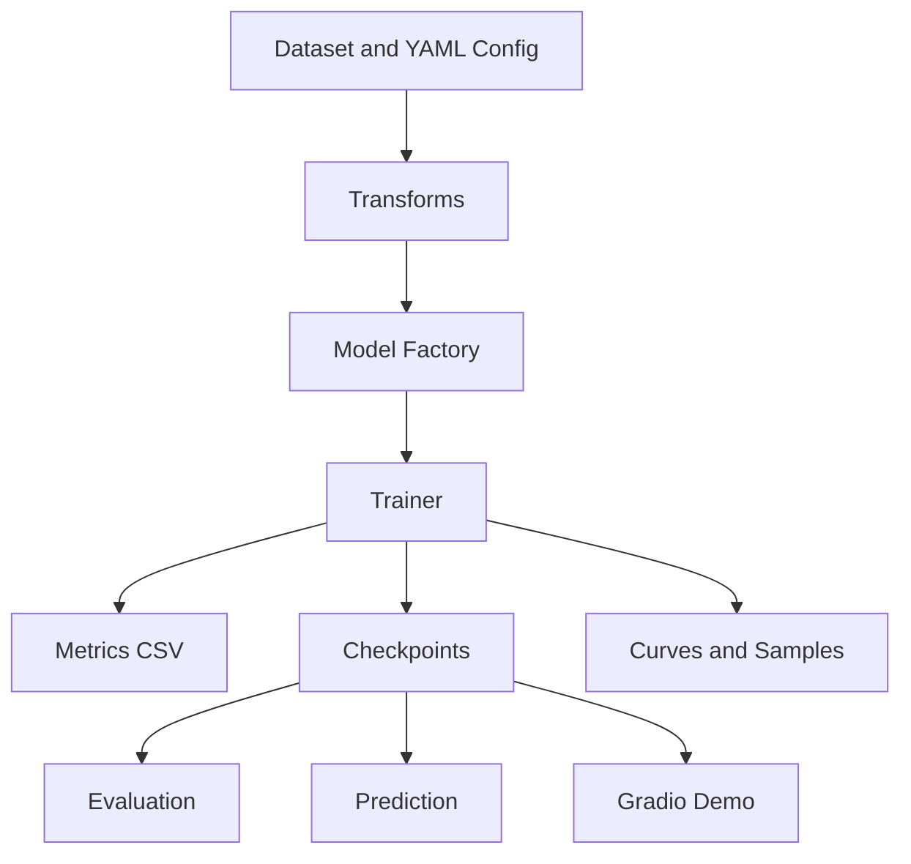

# Technical Report: Skin Lesion Segmentation with Improved U-Net Models

# 技术报告：基于 U-Net 改进模型的皮肤病灶图像分割系统

## 1. Background / 背景

Skin lesion segmentation is a pixel-level medical image analysis task. The goal is to separate lesion regions from surrounding skin in dermoscopic images. Reliable segmentation supports downstream measurements such as lesion area, boundary morphology, and model-assisted image analysis.

皮肤病灶分割是医学图像分析中的像素级任务，目标是在皮肤镜图像中区分病灶区域与周围皮肤。稳定的分割结果可用于病灶面积统计、边界形态分析以及后续图像分析流程。

U-Net is widely used in medical image segmentation because its encoder-decoder architecture combines semantic representation with spatial detail recovery. This project implements a full segmentation system around U-Net and improved U-Net variants.

U-Net 因其 encoder-decoder 结构能够结合语义信息和空间细节，在医学图像分割中被广泛使用。本项目围绕 U-Net 及其改进结构构建完整分割系统。

## 2. Task Definition / 任务定义

The task is binary semantic segmentation. Given an RGB image `x`, the model predicts a one-channel logit map `y`. During inference, sigmoid converts logits into probabilities, and thresholding converts probabilities into a binary mask.

本任务为二分类语义分割。输入为 RGB 图像 `x`，模型输出单通道 logit 图 `y`。推理时通过 sigmoid 将 logits 转换为概率图，再通过阈值生成二值 mask。

## 3. System Architecture / 系统架构

The system consists of the following modules:

系统由以下模块组成：

- Dataset loading: strict image/mask stem matching, binary mask conversion, synchronized augmentation.
- Model factory: U-Net, Attention U-Net, U-Net++, DeepLabV3+, FPN.
- Training: mixed precision, scheduler, early stopping, best/last checkpoints.
- Evaluation: Dice, IoU, Precision, Recall, validation loss.
- Visualization: training curves, prediction masks, overlays, lesion area ratio.
- Kaggle workflow: GPU training and output export.
- Local workflow: CPU/CUDA inference and Gradio Demo.



## 4. Models / 模型

### 4.1 U-Net Baseline / U-Net 基线

The baseline model is a handwritten U-Net with double convolution blocks, downsampling, upsampling, skip connections, and a one-channel output head. The model outputs logits and does not apply sigmoid internally.

基线模型为手写 U-Net，包含 DoubleConv、下采样、上采样、skip connection 和单通道输出层。模型输出 logits，内部不执行 sigmoid。

### 4.2 Attention U-Net / Attention U-Net

Attention U-Net adds attention gates to skip connections. These gates suppress less relevant encoder features and emphasize lesion-related regions.

Attention U-Net 在 skip connection 中加入注意力门控，用于抑制无关背景特征并突出病灶相关区域。

### 4.3 U-Net++ and DeepLabV3+ / U-Net++ 与 DeepLabV3+

U-Net++ uses nested skip connections to reduce the semantic gap between encoder and decoder features. DeepLabV3+ uses atrous convolution and multi-scale context modeling. This project uses `segmentation-models-pytorch` to support these models with ImageNet-pretrained encoders.

U-Net++ 使用嵌套 skip connection 缩小 encoder 与 decoder 特征之间的语义差距。DeepLabV3+ 通过空洞卷积和多尺度上下文建模提升分割能力。本项目通过 `segmentation-models-pytorch` 支持这些结构及 ImageNet 预训练 encoder。

## 5. Training Pipeline / 训练流程

The training pipeline includes:

训练流程包括：

1. Dataset check: verify paths, image/mask matching, binary masks, foreground ratios, overlays.
2. Small-batch overfit: verify data alignment, model, loss, and optimizer.
3. Quick train: verify the full training pipeline before long runs.
4. Full training: train baseline and high-accuracy configurations on Kaggle GPU.
5. Evaluation and export: save metrics, curves, samples, checkpoints.

## 6. Experimental Setup / 实验设置

Training was completed in a Kaggle GPU environment. The local environment supports CPU/CUDA automatic selection for evaluation, prediction, and Gradio Demo.

训练在 Kaggle GPU 环境完成。本地环境支持 CPU/CUDA 自动选择，用于评估、预测和 Gradio Demo。

### 6.1 Dataset Check / 数据检查

The high-accuracy run saved the following sanity check summary:

高精度训练保存的数据检查摘要如下：

```text
Train images: 2000
Train masks: 2000
Train matched pairs: 2000
Val images: 150
Val masks: 150
Val matched pairs: 150
Mean foreground ratio: 0.192484
Min foreground ratio: 0.002977
Max foreground ratio: 0.958930
Invalid binary masks: 0
Image/mask size mismatches: 0
All-black/all-white masks: none reported
```

Report path:

报告路径：

```text
docs/assets/sanity_check/dataset_check_report.md
```

### 6.2 Model Configurations / 模型配置

| Experiment | Model | Encoder | Image Size | Batch Size | Epochs | Optimizer | Scheduler | Loss | Mixed Precision |
| --- | --- | --- | ---: | ---: | ---: | --- | --- | --- | --- |
| U-Net baseline | U-Net | None | 256 | 8 | 30 | Adam | ReduceLROnPlateau | BCE + Dice | Yes |
| High accuracy model | U-Net++ | EfficientNet-B3, ImageNet | 384 | 8 | 50 | AdamW | CosineAnnealingLR | BCE + Dice | Yes |

The high-accuracy run used early stopping with patience 10 and monitored `val_dice`.

高精度训练启用 early stopping，patience 为 10，监控指标为 `val_dice`。

## 7. Metrics / 评价指标

- Dice measures overlap between predicted and ground-truth masks.
- IoU measures intersection-over-union.
- Precision measures correctness among predicted lesion pixels.
- Recall measures recovery of ground-truth lesion pixels.

指标定义：

- Dice 衡量预测 mask 与真实 mask 的重叠程度。
- IoU 衡量交并比。
- Precision 衡量预测为病灶的像素中有多少是正确的。
- Recall 衡量真实病灶像素中有多少被模型找回。

## 8. Results / 实验结果

Results are read from:

结果读取自：

```text
kaggle_outputs/baseline_unet/outputs/experiment_results.csv
kaggle_outputs/high_accuracy/outputs/experiment_results.csv
```

Full Kaggle outputs are kept outside Git tracking. Representative documentation assets are copied to `docs/assets/`.

完整 Kaggle 输出不纳入 Git 跟踪；报告中使用的代表性图片已复制到 `docs/assets/`。

| Experiment | Model | Encoder | Best Epoch | Best Val Loss | Dice | IoU | Precision | Recall | Training Time | Inference Time |
| --- | --- | --- | ---: | ---: | ---: | ---: | ---: | ---: | --- | --- |
| U-Net baseline | U-Net | None | 27 | 0.186221 | 0.839209 | 0.749852 | 0.904178 | 0.836919 | 11m 54s | Not available |
| High accuracy model | U-Net++ | EfficientNet-B3 | 4 | 0.153719 | 0.872120 | 0.792033 | 0.905242 | 0.881161 | 18m 26s | Not available |

Metric differences:

指标差异：

| Metric | U-Net Baseline | High Accuracy | Difference |
| --- | ---: | ---: | ---: |
| Dice | 0.839209 | 0.872120 | +0.032911 |
| IoU | 0.749852 | 0.792033 | +0.042181 |
| Precision | 0.904178 | 0.905242 | +0.001064 |
| Recall | 0.836919 | 0.881161 | +0.044241 |

Training curves:

训练曲线：

```text
docs/assets/results/baseline_unet_training_curves.png
docs/assets/results/high_accuracy_training_curves.png
```


Prediction samples:

预测样例：

```text
docs/assets/samples/baseline_unet/
docs/assets/samples/high_accuracy/
```


## 9. Analysis / 结果分析

### 9.1 Baseline U-Net / Baseline U-Net 表现

The baseline U-Net reached Dice 0.839209 and IoU 0.749852. Its validation metrics improved steadily through the first half of training and reached the best checkpoint at epoch 27. The training loss continued to decrease until epoch 30, while validation loss and metrics fluctuated after the best epoch. This indicates mild overfitting but no severe instability.

U-Net baseline 达到 Dice 0.839209、IoU 0.749852。验证指标在训练前半段持续提升，并在 epoch 27 达到最佳 checkpoint。训练 loss 持续下降到 epoch 30，而验证 loss 和指标在最佳 epoch 后略有波动，说明存在轻微过拟合，但没有明显训练不稳定。

### 9.2 High Accuracy Model / 高精度模型表现

The high-accuracy model reached Dice 0.872120 and IoU 0.792033. It improved the baseline by +0.032911 Dice and +0.042181 IoU. Recall improved by +0.044241, indicating better recovery of lesion pixels. The best checkpoint appeared early at epoch 4, and early stopping ended training at epoch 14.

高精度模型达到 Dice 0.872120、IoU 0.792033，相比 baseline 分别提升 +0.032911 和 +0.042181。Recall 提升 +0.044241，说明模型找回病灶像素的能力更强。最佳 checkpoint 出现在 epoch 4，early stopping 在 epoch 14 结束训练。

### 9.3 Overfitting and Underfitting / 过拟合与欠拟合

Neither model shows underfitting. The high-accuracy model achieved strong validation performance from the first epoch due to the pretrained EfficientNet-B3 encoder. Both models show mild overfitting: training loss keeps decreasing while validation metrics plateau or fluctuate.

两个模型均不存在明显欠拟合。高精度模型由于使用预训练 EfficientNet-B3 encoder，从第一个 epoch 起就获得较高验证指标。两个模型均有轻微过拟合：训练 loss 继续下降，但验证指标进入平台期或出现波动。

### 9.4 Prediction Quality and Failure Cases / 预测质量与失败案例

The downloaded prediction samples do not show all-black or all-white masks. Predicted regions are concentrated around lesions, and no large false-positive regions are visible in the inspected overlays. The high-accuracy samples produce smoother and more aligned masks than the baseline samples.

已下载预测样例没有出现全黑或全白 mask。预测区域集中在病灶附近，检查到的 overlay 中没有明显大面积误检。高精度模型样例比 baseline 更贴合真实区域，边界更平滑。

Sample-level IoU from four downloaded samples:

四张下载样例的样例级 IoU：

| Sample | Baseline IoU | High Accuracy IoU |
| --- | ---: | ---: |
| 0 | 0.896215 | 0.933358 |
| 1 | 0.887648 | 0.942724 |
| 2 | 0.913248 | 0.947615 |
| 3 | 0.738205 | 0.839550 |

Potential failure cases remain possible for very small lesions, low-contrast lesions, hair occlusion, color artifacts, and annotation noise. Current outputs do not include a separate curated failure-case set.

潜在失败场景包括极小病灶、低对比度病灶、毛发遮挡、颜色伪影和标注噪声。目前输出中没有单独整理的失败案例集合。

### 9.5 Improvement Directions / 改进方向

- Learning rate: try `5e-5` for the high-accuracy model to reduce validation fluctuation.
- Batch size: keep 8 when memory allows; use 4 if GPU memory is limited.
- Image size: keep 384 as the current default; test 448 only if memory permits.
- Encoder: compare EfficientNet-B4, ResNet50, and ConvNeXt variants.
- Loss: evaluate Focal + Dice for small-lesion recall.
- Augmentation: add moderate color and geometric augmentation without distorting lesion appearance.
- Epochs: keep early stopping; 20-30 maximum epochs may be enough for the high-accuracy model.

## 10. Deployment / 部署与本地运行

The final default inference files are:

最终默认推理文件：

```text
Checkpoint: checkpoints/best_model.pth
Config: configs/final_model.yaml
```

Local prediction:

本地预测：

```bash
python predict.py --config configs/final_model.yaml --checkpoint checkpoints/best_model.pth --image path/to/image.jpg
```

Gradio Demo:

Gradio 演示：

```bash
python app.py
```

The local runtime supports CPU/CUDA automatic selection. The high-accuracy model requires `segmentation-models-pytorch`.

本地运行支持 CPU/CUDA 自动选择。高精度模型需要安装 `segmentation-models-pytorch`。

## 11. Limitations and Future Work / 局限性与后续工作

Limitations:

局限性：

- Inference time was not persisted in the Kaggle output files.
- Evaluation is based on the available Kaggle validation split.
- No independent external test set is included in the current results.
- The current overlay visualization displays predicted masks; true masks are saved separately.

Future work:

后续工作：

- Add independent test set evaluation.
- Add cross-validation and confidence intervals.
- Compare more pretrained encoders.
- Add post-processing for boundary refinement and small false-positive filtering.
- Export ONNX or TorchScript models for deployment.
- Add batch prediction and structured report export.
