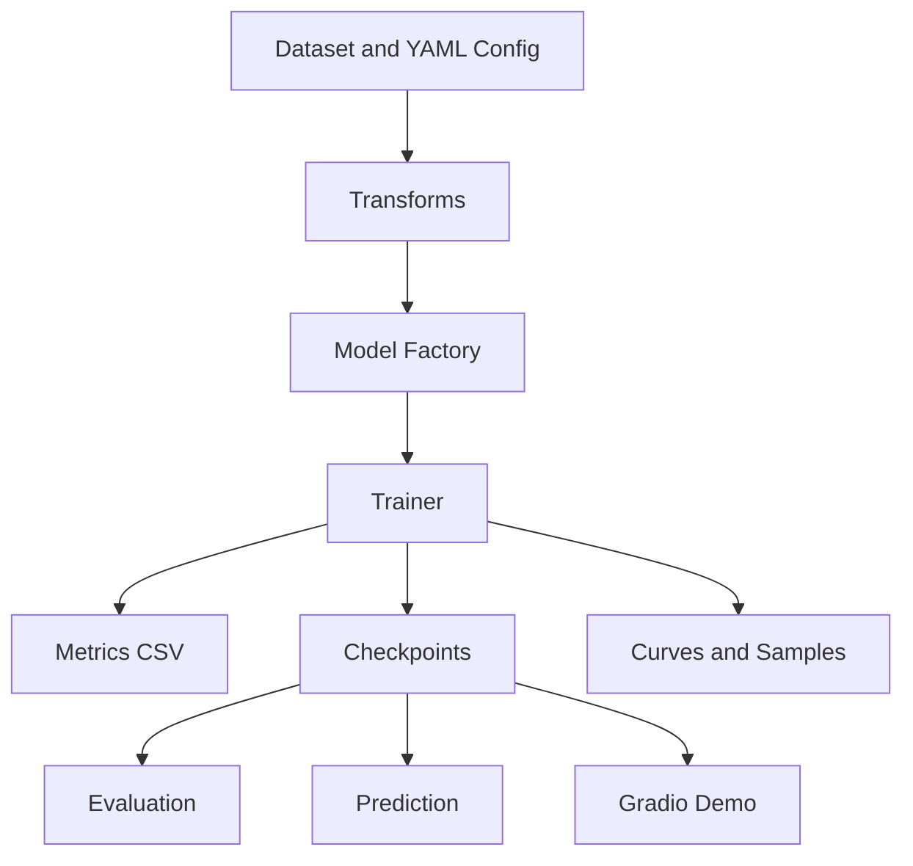
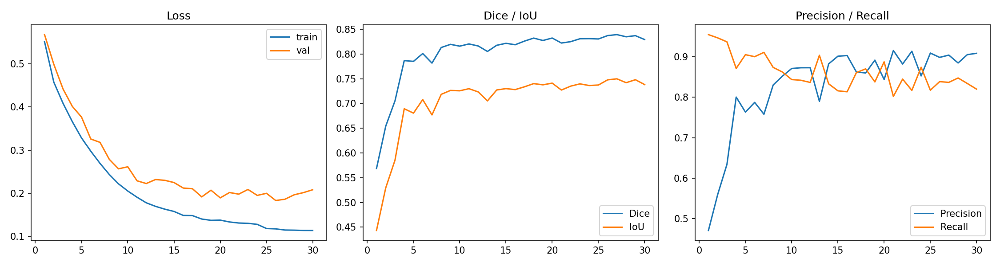
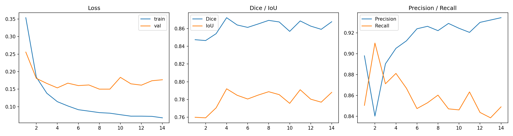
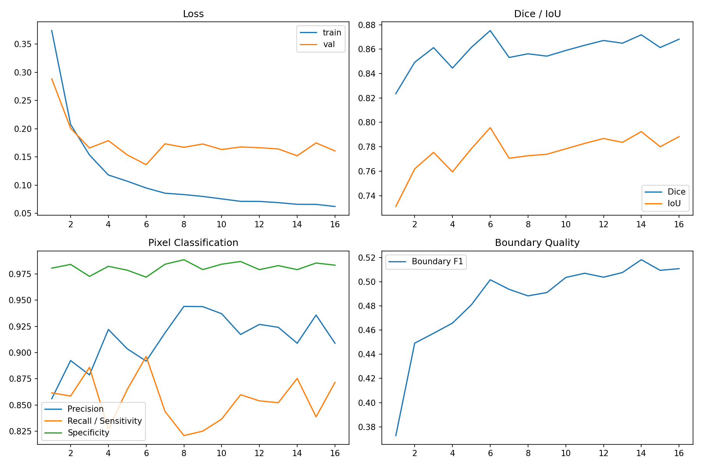
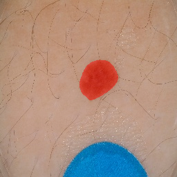
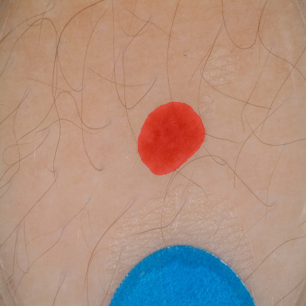

# Technical Report: Skin Lesion Segmentation with Improved U-Net Models

# 技术报告：基于 U-Net 改进模型的皮肤病灶图像分割系统

## 1. Background / 背景

Skin lesion segmentation is a pixel-level medical image analysis task. The goal is to separate lesion regions from surrounding skin in dermoscopic images. Reliable segmentation supports downstream measurements such as lesion area, boundary morphology, and model-assisted image analysis.

皮肤病灶分割是医学图像分析中的像素级任务，目标是在皮肤镜图像中区分病灶区域与周围皮肤。稳定的分割结果可用于病灶面积统计、边界形态分析以及后续图像分析流程。

U-Net is widely used in medical image segmentation because its encoder-decoder architecture combines semantic representation with spatial detail recovery. This project implements a full segmentation system around U-Net and improved U-Net variants.

U-Net 因其 encoder-decoder 结构能够结合语义信息和空间细节，在医学图像分割中被广泛使用。本项目围绕 U-Net 及其改进结构构建完整分割系统。

## 2. Task Definition / 任务定义

The task is binary semantic segmentation. Given an RGB image `x`, the model predicts a one-channel logit map `y`. During inference, sigmoid converts logits into probabilities, and thresholding converts probabilities into a binary mask.

本任务为二分类语义分割。输入为 RGB 图像 `x`，模型输出单通道 logit 图 `y`。推理时通过 sigmoid 将 logits 转换为概率图，再通过阈值生成二值 mask。

## 3. System Architecture / 系统架构

The system consists of the following modules:

系统由以下模块组成：

- Dataset loading: strict image/mask stem matching, binary mask conversion, synchronized augmentation.
- Model factory: U-Net, Attention U-Net, U-Net++, DeepLabV3+, FPN.
- Training: mixed precision, scheduler, early stopping, best/last checkpoints.
- Resume training: restore model, optimizer, scheduler, AMP scaler, history, and early-stopping state from `last_model.pth`.
- Evaluation: Dice, IoU, Precision, Recall/Sensitivity, Specificity, Boundary F1, validation loss.
- Visualization: training curves, prediction masks, overlays, lesion area ratio.
- Kaggle workflow: GPU training and output export.
- Local workflow: CPU/CUDA inference and Gradio Demo.



## 4. Models / 模型

### 4.1 U-Net Baseline / U-Net 基线

The baseline model is a handwritten U-Net with double convolution blocks, downsampling, upsampling, skip connections, and a one-channel output head. The model outputs logits and does not apply sigmoid internally.

基线模型为手写 U-Net，包含 DoubleConv、下采样、上采样、skip connection 和单通道输出层。模型输出 logits，内部不执行 sigmoid。

### 4.2 Attention U-Net / Attention U-Net

Attention U-Net adds attention gates to skip connections. These gates suppress less relevant encoder features and emphasize lesion-related regions.

Attention U-Net 在 skip connection 中加入注意力门控，用于抑制无关背景特征并突出病灶相关区域。

### 4.3 U-Net++ and DeepLabV3+ / U-Net++ 与 DeepLabV3+

U-Net++ uses nested skip connections to reduce the semantic gap between encoder and decoder features. DeepLabV3+ uses atrous convolution and multi-scale context modeling. This project uses `segmentation-models-pytorch` to support these models with ImageNet-pretrained encoders.

U-Net++ 使用嵌套 skip connection 缩小 encoder 与 decoder 特征之间的语义差距。DeepLabV3+ 通过空洞卷积和多尺度上下文建模提升分割能力。本项目通过 `segmentation-models-pytorch` 支持这些结构及 ImageNet 预训练 encoder。

## 5. Training Pipeline / 训练流程

The training pipeline includes:

训练流程包括：

1. Dataset check: verify paths, image/mask matching, binary masks, foreground ratios, overlays.
2. Small-batch overfit: verify data alignment, model, loss, and optimizer.
3. Quick train: verify the full training pipeline before long runs.
4. Full training: train baseline and high-accuracy configurations on Kaggle GPU.
5. Evaluation and export: save metrics, curves, samples, checkpoints.
6. Research workflow: run 3-fold cross-validation, encoder comparison, subgroup analysis, and statistical summaries on Kaggle.

## 6. Experimental Setup / 实验设置

Training was completed in a Kaggle GPU environment. The local environment supports CPU/CUDA automatic selection for evaluation, prediction, and Gradio Demo.

训练在 Kaggle GPU 环境完成。本地环境支持 CPU/CUDA 自动选择，用于评估、预测和 Gradio Demo。

The experiment dataset is the ISIC 2017 segmentation train/validation split obtained through the Kaggle mirror `moon1570/isic-2017-train-val-test-images-and-masks`. The project does not redistribute medical images. Provenance and licensing boundaries are recorded in [`DATASET.md`](../DATASET.md).

实验数据为通过 Kaggle 镜像 `moon1570/isic-2017-train-val-test-images-and-masks` 获取的 ISIC 2017 分割 train/validation 划分。本项目不再分发医疗图像，数据来源和授权边界记录在 [`DATASET.md`](../DATASET.md)。

Future runs use deterministic PyTorch algorithms and seeded DataLoader workers by default. The legacy v1.0.0 run used seed 42, but its checkpoint did not persist complete package versions or the source commit; this limitation is recorded rather than reconstructed.

后续训练默认使用 PyTorch 确定性算法和 DataLoader worker 随机种子。v1.0.0 历史实验使用 seed 42，但 checkpoint 未保存完整依赖版本和源码 commit；本报告将其如实记录为限制，不进行推测。

### 6.1 Dataset Check / 数据检查

The high-accuracy run saved the following sanity check summary:

高精度训练保存的数据检查摘要如下：

```text
Train images: 2000
Train masks: 2000
Train matched pairs: 2000
Val images: 150
Val masks: 150
Val matched pairs: 150
Mean foreground ratio: 0.192484
Min foreground ratio: 0.002977
Max foreground ratio: 0.958930
Invalid binary masks: 0
Image/mask size mismatches: 0
All-black/all-white masks: none reported
```

Report path:

报告路径：

```text
docs/assets/sanity_check/dataset_check_report.md
```

### 6.2 Model Configurations / 模型配置

| Experiment | Model | Encoder | Image Size | Batch Size | Epochs | Optimizer | Scheduler | Loss | Mixed Precision |
| --- | --- | --- | ---: | ---: | ---: | --- | --- | --- | --- |
| U-Net baseline | U-Net | None | 256 | 8 | 30 | Adam | ReduceLROnPlateau | BCE + Dice | Yes |
| High accuracy model | U-Net++ | EfficientNet-B3, ImageNet | 384 | 8 | 50 | AdamW | CosineAnnealingLR | BCE + Dice | Yes |

The high-accuracy run used early stopping with patience 10 and monitored `val_dice`.

高精度训练启用 early stopping，patience 为 10，监控指标为 `val_dice`。

## 7. Metrics / 评价指标

- Dice measures overlap between predicted and ground-truth masks.
- IoU measures intersection-over-union.
- Precision measures correctness among predicted lesion pixels.
- Recall measures recovery of ground-truth lesion pixels.
- Sensitivity is equivalent to Recall for the foreground class.
- Specificity measures correctly rejected background pixels.
- Boundary F1 measures boundary agreement within a pixel tolerance.

指标定义：

- Dice 衡量预测 mask 与真实 mask 的重叠程度。
- IoU 衡量交并比。
- Precision 衡量预测为病灶的像素中有多少是正确的。
- Recall 衡量真实病灶像素中有多少被模型找回。
- Sensitivity 在前景类上与 Recall 等价。
- Specificity 衡量背景像素被正确排除的比例。
- Boundary F1 衡量给定像素容差内的边界一致性。

Specificity and Boundary F1 were added after the v1.0.0 training run, so they are not backfilled into the historical result table.

Specificity 和 Boundary F1 是在 v1.0.0 训练完成后增加的，因此不对历史结果表进行推测回填。

## 8. Results / 实验结果

Results are read from:

结果读取自：

```text
kaggle_outputs/baseline_unet/outputs/experiment_results.csv
kaggle_outputs/high_accuracy/outputs/experiment_results.csv
kaggle_outputs/repeated_experiment/repeated_experiments/summary.csv
kaggle_outputs/repeated_experiment/repeated_experiments/all_seed_metrics.csv
kaggle_outputs/repeated_experiment/repeated_experiments/benchmark/benchmark.csv
kaggle_outputs/posthoc_analysis/posthoc_analysis/threshold_search/threshold_search.csv
kaggle_outputs/posthoc_analysis/posthoc_analysis/failure_cases_test/failure_cases.csv
kaggle_outputs/posthoc_analysis/posthoc_analysis/failure_cases_external/failure_cases.csv
kaggle_outputs/research_v1_2/medical-segmentation-research-artifacts-v1.2/research_v1_2/
```

Full Kaggle outputs are kept outside Git tracking. Representative documentation assets are copied to `docs/assets/`.

完整 Kaggle 输出不纳入 Git 跟踪；报告中使用的代表性图片已复制到 `docs/assets/`。

| Experiment | Model | Encoder | Best Epoch | Val Loss at Best Dice Epoch | Dice | IoU | Precision | Recall | Training Time | Inference Time |
| --- | --- | --- | ---: | ---: | ---: | ---: | ---: | ---: | --- | --- |
| U-Net baseline | U-Net | None | 27 | 0.186221 | 0.839209 | 0.749852 | 0.904178 | 0.836919 | 11m 54s | Not available |
| High accuracy model | U-Net++ | EfficientNet-B3 | 4 | 0.153719 | 0.872120 | 0.792033 | 0.905242 | 0.881161 | 18m 26s | Not available |

Metric differences:

指标差异：

| Metric | U-Net Baseline | High Accuracy | Difference |
| --- | ---: | ---: | ---: |
| Dice | 0.839209 | 0.872120 | +0.032911 |
| IoU | 0.749852 | 0.792033 | +0.042181 |
| Precision | 0.904178 | 0.905242 | +0.001064 |
| Recall | 0.836919 | 0.881161 | +0.044241 |

Repeated high-accuracy evaluation:

高精度模型重复实验：

| Split | Runs | Dice mean ± std | IoU mean ± std | Precision mean ± std | Recall mean ± std | Boundary F1 mean ± std |
| --- | ---: | ---: | ---: | ---: | ---: | ---: |
| Validation | 3 | 0.870568 ± 0.004248 | 0.791262 ± 0.004706 | 0.918614 ± 0.023204 | 0.866186 ± 0.026165 | 0.511059 ± 0.013607 |
| Independent test | 3 | 0.852301 ± 0.009611 | 0.769329 ± 0.012870 | 0.947166 ± 0.010456 | 0.815953 ± 0.022209 | 0.418462 ± 0.020804 |
| External ISIC 2018 | 3 | 0.915828 ± 0.006676 | 0.857054 ± 0.011829 | 0.956375 ± 0.014224 | 0.895332 ± 0.025478 | 0.513946 ± 0.065410 |

The best repeated run by validation Dice used seed `42`. The three runs stopped early at epochs 16, 15, and 24 for seeds 42, 123, and 2026 respectively.

按验证集 Dice 选择的最佳重复实验 seed 为 `42`。三个 seed 分别在 epoch 16、15 和 24 通过 early stopping 结束。

Inference benchmark for the best repeated checkpoint:

最佳重复实验 checkpoint 推理基准：

| Device | Mean latency | P95 latency | Throughput | Peak memory |
| --- | ---: | ---: | ---: | ---: |
| CPU x86_64 | 497.374 ms | 524.090 ms | 2.011 img/s | 1313.23 MB RSS |
| CUDA Tesla P100-PCIE-16GB | 23.867 ms | 25.603 ms | 41.898 img/s | 151.85 MB allocated |

Model parameters: `13,624,793`; model state size: `52.32 MB`; checkpoint size: `152.32 MB`.

模型参数量为 `13,624,793`，模型 state 大小为 `52.32 MB`，checkpoint 大小为 `152.32 MB`。

Post-hoc threshold search:

后处理阈值搜索：

| Threshold | Validation Dice | Validation IoU | Precision | Recall |
| ---: | ---: | ---: | ---: | ---: |
| 0.35 | 0.876188 | 0.779657 | 0.895335 | 0.857843 |
| 0.50 | 0.872413 | 0.773700 | 0.917849 | 0.831264 |

The recommended inference threshold is therefore set to `0.35` in `configs/final_model.yaml`.

因此，`configs/final_model.yaml` 中推荐推理阈值设置为 `0.35`。

Training curves:

训练曲线：

```text
docs/assets/results/baseline_unet_training_curves.png
docs/assets/results/high_accuracy_training_curves.png
docs/assets/results/repeated_experiment/seed_42_training_curves.png
```







Prediction samples:

预测样例：

```text
docs/assets/samples/baseline_unet/
docs/assets/samples/high_accuracy/
docs/assets/samples/repeated_experiment/
```






### 8.1 Research Workflow v1.2 / 研究增强流程 v1.2

Version 1.2 was executed on Kaggle GPU as a small-budget robustness analysis workflow. It reports cross-validation, encoder comparison, threshold search, subgroup analysis, and statistical summaries. It does not publish new model weights and does not replace the existing default inference checkpoint.

v1.2 已在 Kaggle GPU 上完成运行，作为小预算稳健性分析流程。该流程报告交叉验证、encoder 对比、阈值搜索、子组分析和统计汇总。它不发布新模型权重，也不替换现有默认推理 checkpoint。

Execution manifest:

执行清单：

```text
Source commit: ed93c3a9d58d28de819043b5c0472627364cfd86
Internal dataset: moon1570/isic-2017-train-val-test-images-and-masks
External dataset: tntiphan/isic-2018-task-1
Cross-validation folds: 3
Cross-validation epochs: 15
Encoder comparison epochs: 20
Compared encoders: efficientnet-b3, resnet34
Best encoder by validation Dice: efficientnet-b3
Best v1.2 threshold: 0.55
```

The v1.2 dataset check found 2,000 train image/mask pairs and 150 validation image/mask pairs, with zero invalid binary masks and no image/mask mismatches. The mean mask foreground ratio was `0.192484`.

v1.2 数据检查发现 2,000 对训练图像/mask 和 150 对验证图像/mask，无无效二值 mask，未发现 image/mask 尺寸或匹配错误。mask 平均前景比例为 `0.192484`。

3-fold cross-validation:

3 折交叉验证：

| Metric | Mean | Std | Min | Max | 95% CI |
| --- | ---: | ---: | ---: | ---: | --- |
| Dice | 0.907006 | 0.003104 | 0.903474 | 0.909298 | 0.903494-0.910518 |
| IoU | 0.841579 | 0.003732 | 0.837271 | 0.843789 | 0.837357-0.845802 |
| Precision | 0.927466 | 0.009870 | 0.917520 | 0.937258 | 0.916297-0.938635 |
| Recall | 0.909939 | 0.006971 | 0.902043 | 0.915241 | 0.902050-0.917827 |
| Specificity | 0.982133 | 0.001544 | 0.980465 | 0.983513 | Not available |
| Boundary F1 | 0.538169 | 0.011199 | 0.531467 | 0.551098 | Not available |
| Loss | 0.108300 | 0.006976 | 0.103654 | 0.116322 | 0.100406-0.116194 |

Encoder comparison:

Encoder 对比：

| Encoder | Dice | IoU | Precision | Recall | Specificity | Boundary F1 | Loss | Best Epoch |
| --- | ---: | ---: | ---: | ---: | ---: | ---: | ---: | ---: |
| EfficientNet-B3 | 0.870200 | 0.790512 | 0.885267 | 0.896205 | 0.967987 | 0.500648 | 0.139043 | 6 |
| ResNet34 | 0.857985 | 0.775294 | 0.913277 | 0.856506 | 0.977918 | 0.478584 | 0.163083 | 15 |

Threshold search for the v1.2 encoder-comparison checkpoint selected threshold `0.55`, with Dice `0.875356`, IoU `0.778340`, Precision `0.890919`, and Recall `0.860326`.

v1.2 encoder-comparison checkpoint 的阈值搜索选择 threshold `0.55`，对应 Dice `0.875356`、IoU `0.778340`、Precision `0.890919`、Recall `0.860326`。

Subgroup analysis highlights:

子组分析重点：

- Internal ISIC 2017 test: low-contrast images are weaker than high-contrast images (`0.832174` vs `0.902537` Dice). Large/high-ratio lesions show lower recall than small/low-ratio lesions.
- External ISIC 2018: overall subgroup Dice is higher, but low-contrast and small-lesion groups remain weaker than high-contrast or large-lesion groups.
- These patterns suggest that contrast variation and boundary ambiguity are more important failure drivers than the encoder choice alone.

- ISIC 2017 内部测试集：低对比度图像弱于高对比度图像（Dice `0.832174` vs `0.902537`）。大面积/高占比病灶的 recall 低于小面积/低占比病灶。
- ISIC 2018 外部集：整体子组 Dice 更高，但低对比度和小病灶组仍弱于高对比度或大病灶组。
- 这些结果表明，对比度变化和边界模糊比单纯更换 encoder 更可能成为主要失败因素。

Representative v1.2 output files:

v1.2 代表性输出文件：

```text
docs/assets/results/research_v1_2/cv_fold_1_training_curves.png
docs/assets/results/research_v1_2/encoder_effb3_training_curves.png
docs/assets/results/research_v1_2/encoder_resnet34_training_curves.png
docs/assets/samples/research_v1_2/encoder_effb3_sample_000_overlay.png
docs/assets/sanity_check/research_v1_2/dataset_overlay_00_isic_0012940.png
docs/assets/analysis/research_v1_2/cross_validation_summary.md
docs/assets/analysis/research_v1_2/encoder_comparison_summary.md
docs/assets/analysis/research_v1_2/threshold_search.md
```

## 9. Analysis / 结果分析

### 9.1 Baseline U-Net / Baseline U-Net 表现

The baseline U-Net reached Dice 0.839209 and IoU 0.749852. Its validation metrics improved steadily through the first half of training and reached the best checkpoint at epoch 27. The training loss continued to decrease until epoch 30, while validation loss and metrics fluctuated after the best epoch. This indicates mild overfitting but no severe instability.

U-Net baseline 达到 Dice 0.839209、IoU 0.749852。验证指标在训练前半段持续提升，并在 epoch 27 达到最佳 checkpoint。训练 loss 持续下降到 epoch 30，而验证 loss 和指标在最佳 epoch 后略有波动，说明存在轻微过拟合，但没有明显训练不稳定。

### 9.2 High Accuracy Model / 高精度模型表现

The high-accuracy model reached Dice 0.872120 and IoU 0.792033. It improved the baseline by +0.032911 Dice and +0.042181 IoU. Recall improved by +0.044241, indicating better recovery of lesion pixels. The best checkpoint appeared early at epoch 4, and early stopping ended training at epoch 14.

高精度模型达到 Dice 0.872120、IoU 0.792033，相比 baseline 分别提升 +0.032911 和 +0.042181。Recall 提升 +0.044241，说明模型找回病灶像素的能力更强。最佳 checkpoint 出现在 epoch 4，early stopping 在 epoch 14 结束训练。

### 9.3 Overfitting and Underfitting / 过拟合与欠拟合

Neither model shows underfitting. The high-accuracy model achieved strong validation performance early due to the pretrained EfficientNet-B3 encoder. The repeated runs show low validation Dice variability (`std = 0.004248`) and moderate test Dice variability (`std = 0.009611`). Training loss continues to decrease while validation metrics plateau or fluctuate, which indicates mild overfitting but not severe instability.

两个模型均不存在明显欠拟合。高精度模型由于使用预训练 EfficientNet-B3 encoder，较早获得较高验证指标。重复实验的验证集 Dice 波动较小（`std = 0.004248`），测试集 Dice 波动中等（`std = 0.009611`）。训练 loss 继续下降但验证指标进入平台期或波动，说明存在轻微过拟合，但没有严重训练不稳定。

### 9.4 Independent and External Evaluation / 独立测试与外部验证

The independent ISIC 2017 test split reached Dice `0.852301 ± 0.009611` and IoU `0.769329 ± 0.012870`, lower than validation Dice but still stable across seeds. Precision remains high (`0.947166 ± 0.010456`) while recall is lower (`0.815953 ± 0.022209`), indicating a conservative segmentation tendency on the internal test set.

ISIC 2017 独立测试集达到 Dice `0.852301 ± 0.009611`、IoU `0.769329 ± 0.012870`，低于验证集但跨 seed 表现稳定。Precision 较高（`0.947166 ± 0.010456`），Recall 较低（`0.815953 ± 0.022209`），说明模型在内部测试集上更偏保守分割。

The external ISIC 2018 split reached Dice `0.915828 ± 0.006676` and IoU `0.857054 ± 0.011829`. This result should be interpreted as an engineering external validation on the prepared Kaggle mirror, not as clinical generalization evidence. Dataset composition, preprocessing, and annotation differences can make cross-dataset scores higher or lower than the internal split.

ISIC 2018 外部集达到 Dice `0.915828 ± 0.006676`、IoU `0.857054 ± 0.011829`。该结果应解释为基于 Kaggle 镜像和当前预处理流程的工程外部验证，而不是临床泛化证据。数据组成、预处理方式和标注差异都可能使跨数据集分数高于或低于内部划分。

### 9.5 Threshold Search / 阈值搜索

Validation threshold search found `0.35` as the best threshold by Dice. Compared with the default `0.50`, threshold `0.35` increased validation Dice from `0.872413` to `0.876188` and recall from `0.831264` to `0.857843`, while precision decreased from `0.917849` to `0.895335`. This trade-off is reasonable for a segmentation demo because it reduces missed lesion pixels.

验证集阈值搜索发现，按 Dice 最优的阈值为 `0.35`。与默认 `0.50` 相比，`0.35` 将验证集 Dice 从 `0.872413` 提升到 `0.876188`，Recall 从 `0.831264` 提升到 `0.857843`，但 Precision 从 `0.917849` 降至 `0.895335`。对分割 demo 而言，该权衡可以减少病灶像素漏检，因而是合理的。

### 9.6 Prediction Quality and Failure Cases / 预测质量与失败案例

The downloaded prediction samples do not show all-black or all-white masks. Predicted regions are concentrated around lesions, and no large false-positive regions are visible in the inspected overlays. The high-accuracy samples produce smoother and more aligned masks than the baseline samples. The post-hoc failure analysis also found zero empty predictions on both ISIC 2017 test and external ISIC 2018 splits.

已下载预测样例没有出现全黑或全白 mask。预测区域集中在病灶附近，检查到的 overlay 中没有明显大面积误检。高精度模型样例比 baseline 更贴合真实区域，边界更平滑。后处理失败案例分析也显示，ISIC 2017 test 和外部 ISIC 2018 中均没有空预测。

Failure analysis summary at threshold `0.35`:

阈值 `0.35` 下的失败案例统计：

| Split | Samples | Mean Dice | Mean IoU | Over-segmentation | Under-segmentation | Empty prediction |
| --- | ---: | ---: | ---: | ---: | ---: | ---: |
| ISIC 2017 test | 600 | 0.858912 | 0.778042 | 111 | 174 | 0 |
| External ISIC 2018 | 1002 | 0.924017 | 0.870954 | 93 | 104 | 0 |

Sample-level IoU from four downloaded samples:

四张下载样例的样例级 IoU：

| Sample | Baseline IoU | High Accuracy IoU |
| --- | ---: | ---: |
| 0 | 0.896215 | 0.933358 |
| 1 | 0.887648 | 0.942724 |
| 2 | 0.913248 | 0.947615 |
| 3 | 0.738205 | 0.839550 |

Potential failure cases remain possible for very small lesions, low-contrast lesions, hair occlusion, color artifacts, and annotation noise. Current outputs do not include a separate curated failure-case set.

潜在失败场景包括极小病灶、低对比度病灶、毛发遮挡、颜色伪影和标注噪声。目前输出中没有单独整理的失败案例集合。

The v1.2 subgroup results strengthen this interpretation: low-contrast images are consistently weaker than high-contrast images on both internal and external splits. This suggests that future improvement should prioritize contrast-aware augmentation, artifact simulation, and boundary refinement rather than only increasing model capacity.

v1.2 子组结果进一步支持该判断：低对比度图像在内部和外部划分上均弱于高对比度图像。因此后续改进应优先考虑对比度增强、伪影模拟和边界细化，而不是只增加模型容量。

### 9.7 Low-Contrast Specialist Workflow v1.3 / v1.3 低对比度专项流程

The v1.3 workflow is designed to test the hypothesis that contrast-aware augmentation and false-negative-sensitive loss functions can improve low-contrast lesion segmentation. It compares four variants: the current BCE + Dice control recipe, low-contrast augmentation with BCE + Dice, low-contrast augmentation with Focal + Dice, and low-contrast augmentation with Tversky loss.

v1.3 流程用于验证一个假设：对比度感知增强和更重视 false negative 的 loss 能否改善低对比度病灶分割。该流程比较四个变体：当前 BCE + Dice 对照方案、低对比度增强 + BCE + Dice、低对比度增强 + Focal + Dice、低对比度增强 + Tversky loss。

The default model is not changed by v1.3 code alone. Replacement is considered only when the completed Kaggle comparison shows a low-contrast Dice improvement of at least `+0.02` or low-contrast Recall improvement of at least `+0.03`, while overall internal-test Dice drops by no more than `0.01`.

v1.3 代码本身不会改变默认模型。只有当完成的 Kaggle 对比显示低对比度 Dice 至少提升 `+0.02` 或低对比度 Recall 至少提升 `+0.03`，且整体 internal-test Dice 下降不超过 `0.01` 时，才考虑替换默认模型。

The v1.3 Kaggle script is restart-safe. It skips variants marked with `completed.json` and resumes unfinished variants from `last_model.pth`, which is important when Kaggle GPU sessions reach their maximum runtime.

v1.3 Kaggle 脚本支持重提续跑。它会跳过带有 `completed.json` 的 variant，并从未完成 variant 的 `last_model.pth` 继续训练，这对 Kaggle GPU 会话达到最长运行时间的场景很重要。

### 9.8 Runtime and Deployment Characteristics / 运行时与部署特性

The best repeated checkpoint contains 13.62M trainable parameters. On Kaggle Tesla P100, FP32 forward latency is 23.867 ms per 384x384 image, corresponding to 41.898 images/s. CPU inference remains usable for single-image local demo scenarios at 497.374 ms per image, but batch processing should prefer CUDA.

最佳重复实验 checkpoint 包含 13.62M 可训练参数。在 Kaggle Tesla P100 上，384x384 单图 FP32 前向延迟为 23.867 ms，对应 41.898 images/s。CPU 单图推理为 497.374 ms，足够用于本地单图 demo，但批量处理更适合使用 CUDA。

### 9.9 Improvement Directions / 改进方向

- Learning rate: try `5e-5` for the high-accuracy model to reduce validation fluctuation.
- Batch size: keep 8 when memory allows; use 4 if GPU memory is limited.
- Image size: keep 384 as the current default; test 448 only if memory permits.
- Encoder: compare EfficientNet-B4, ResNet50, and ConvNeXt variants.
- Loss: evaluate Focal + Dice for small-lesion recall.
- Augmentation: use the v1.3 low-contrast workflow to evaluate CLAHE, gamma, low-contrast simulation, and stronger brightness/contrast augmentation.
- Epochs: keep early stopping; repeated runs stopped at 15-24 epochs, so 30 maximum epochs is usually enough unless a new encoder or dataset is introduced.

## 10. Deployment / 部署与本地运行

The final default inference files are:

最终默认推理文件：

```text
Checkpoint: checkpoints/best_model.pth
Config: configs/final_model.yaml
Threshold: 0.35
```

The verified release URL, SHA256 digest, architecture, and validation scope are documented in [`MODEL_CARD.md`](../MODEL_CARD.md) and [`models/model_manifest.yaml`](../models/model_manifest.yaml). The inference loader uses `weights_only=True` and validates checkpoint architecture metadata before loading parameters.

已验证的 Release 地址、SHA256、模型架构和验证范围记录在 [`MODEL_CARD.md`](../MODEL_CARD.md) 和 [`models/model_manifest.yaml`](../models/model_manifest.yaml)。推理端使用 `weights_only=True` 安全加载，并在载入参数前验证 checkpoint 架构元数据。

Local prediction:

本地预测：

```bash
python predict.py --config configs/final_model.yaml --checkpoint checkpoints/best_model.pth --image path/to/image.jpg
```

Batch prediction:

批量预测：

```bash
python batch_predict.py --config configs/final_model.yaml --checkpoint checkpoints/best_model.pth --input-dir path/to/images
```

The batch workflow exports masks, overlays, lesion area ratios, `batch_predictions.csv`, and `batch_summary.json`.

批量流程会导出 mask、overlay、病灶面积比例、`batch_predictions.csv` 和 `batch_summary.json`。

Model export:

模型导出：

```bash
python export.py --config configs/final_model.yaml --checkpoint checkpoints/best_model.pth --formats torchscript,onnx
```

The exported TorchScript and ONNX models output logits. Sigmoid and thresholding remain in the serving or post-processing layer.

导出的 TorchScript 和 ONNX 模型输出 logits。sigmoid 和 threshold 仍位于服务端或后处理层。

Gradio Demo:

Gradio 演示：

```bash
python app.py
```

Docker Demo:

Docker 演示：

```bash
docker build -t medical-image-segmentation .
docker run --rm -p 7860:7860 -v "$PWD/checkpoints:/app/checkpoints" medical-image-segmentation
```

The local runtime supports CPU/CUDA automatic selection. The high-accuracy model requires `segmentation-models-pytorch`.

本地运行支持 CPU/CUDA 自动选择。高精度模型需要安装 `segmentation-models-pytorch`。

## 11. Current Limitations and Future Work / 当前限制与后续工作

Limitations:

局限性：

- Repeated evaluation covers validation, independent ISIC 2017 test, and external ISIC 2018 splits, but it is still dataset-level engineering validation rather than clinical validation.
- CPU/CUDA inference benchmarks were measured on Kaggle x86_64 and Tesla P100; local hardware may differ.
- v1.2 adds cross-validation, subgroup analysis, and statistical summaries, but the workflow remains small-budget and does not replace large-scale multi-center evaluation.
- Calibration study, reader study, and clinical validation are not included.
- The legacy v1.0.0 checkpoint did not record complete package versions or a source commit.
- The current overlay visualization displays predicted masks; true masks are saved separately.

Future work:

后续工作：

- Publish the sanitized v1.2 research artifact package as a GitHub Release asset.
- Extend subgroup analysis with body site and imaging-artifact metadata when available.
- Compare more pretrained encoders.
- Add post-processing for boundary refinement and small false-positive filtering.
- Add deployment benchmarks for ONNX Runtime and TorchScript runtimes.
- Run and report the v1.3 low-contrast specialist Kaggle workflow.

## 12. Medical Disclaimer / 医学免责声明

中文：
本项目仅用于医学图像分割算法实验和工程流程验证，不用于临床诊断、治疗建议或真实医疗决策。

English:
This project is intended only for medical image segmentation experiments and engineering workflow validation. It is not intended for clinical diagnosis, treatment recommendation, or real-world medical decision-making.
