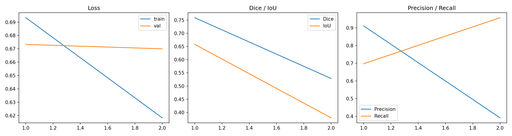
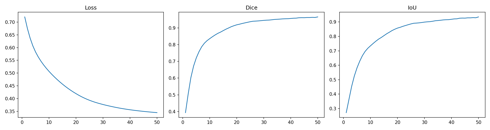

# Sanity-Check Curves / 流程检查曲线

These runs verify data loading, optimization, and overfitting behavior. They are not benchmark experiments.

这些 run 用于验证数据加载、优化与小样本过拟合行为，不属于性能 benchmark。

## Quick Train

[Raw metrics CSV](../assets/experiments/sanity/quick_train/outputs/metrics.csv)

## Small-Batch Overfit

[Overfit report](../assets/experiments/sanity/overfit/overfit_report.md)

