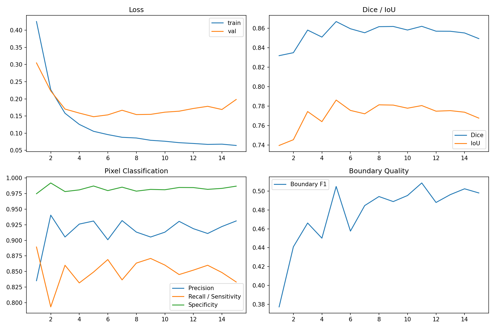
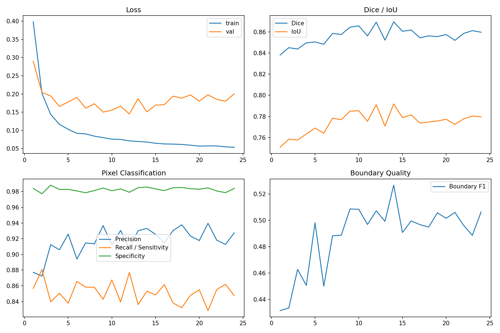

# v1.1 Repeated-Seed Curves / 重复种子训练曲线

The three U-Net++ EfficientNet-B3 runs use seeds `42`, `123`, and `2026`.

## Seed 42

[Raw metrics CSV](../assets/experiments/v1.1/repeated_experiments/seed_42/outputs/metrics.csv) | [Training history CSV](../assets/experiments/v1.1/repeated_experiments/seed_42/outputs/training_history.csv)

## Seed 123

[Raw metrics CSV](../assets/experiments/v1.1/repeated_experiments/seed_123/outputs/metrics.csv) | [Training history CSV](../assets/experiments/v1.1/repeated_experiments/seed_123/outputs/training_history.csv)

## Seed 2026

[Raw metrics CSV](../assets/experiments/v1.1/repeated_experiments/seed_2026/outputs/metrics.csv) | [Training history CSV](../assets/experiments/v1.1/repeated_experiments/seed_2026/outputs/training_history.csv)

