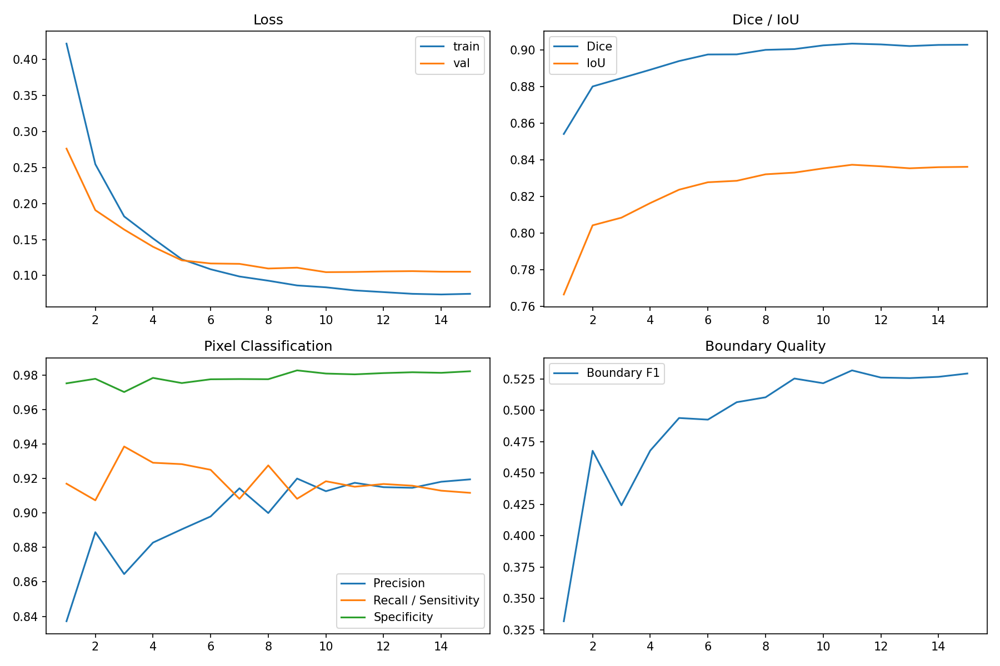
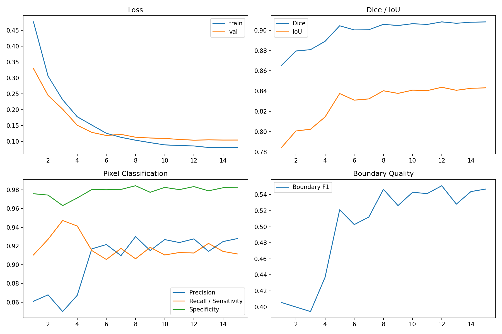
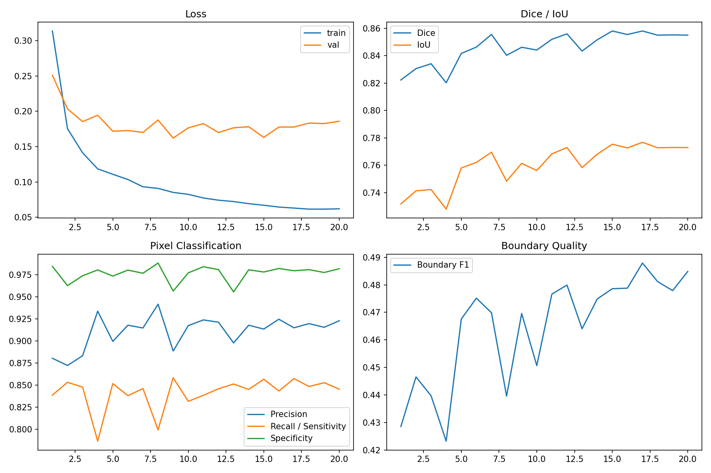

# v1.2 Research Curves / 研究训练曲线

## Cross-Validation Fold 0

[Raw metrics CSV](../assets/experiments/v1.2/cross_validation/fold_0/outputs/metrics.csv) | [Training history CSV](../assets/experiments/v1.2/cross_validation/fold_0/outputs/training_history.csv)

## Cross-Validation Fold 1

[Raw metrics CSV](../assets/experiments/v1.2/cross_validation/fold_1/outputs/metrics.csv) | [Training history CSV](../assets/experiments/v1.2/cross_validation/fold_1/outputs/training_history.csv)

## Cross-Validation Fold 2

[Raw metrics CSV](../assets/experiments/v1.2/cross_validation/fold_2/outputs/metrics.csv) | [Training history CSV](../assets/experiments/v1.2/cross_validation/fold_2/outputs/training_history.csv)

## EfficientNet-B3 Encoder

[Raw metrics CSV](../assets/experiments/v1.2/encoder_comparison/efficientnet-b3/outputs/metrics.csv) | [Training history CSV](../assets/experiments/v1.2/encoder_comparison/efficientnet-b3/outputs/training_history.csv)

## ResNet34 Encoder

[Raw metrics CSV](../assets/experiments/v1.2/encoder_comparison/resnet34/outputs/metrics.csv) | [Training history CSV](../assets/experiments/v1.2/encoder_comparison/resnet34/outputs/training_history.csv)

