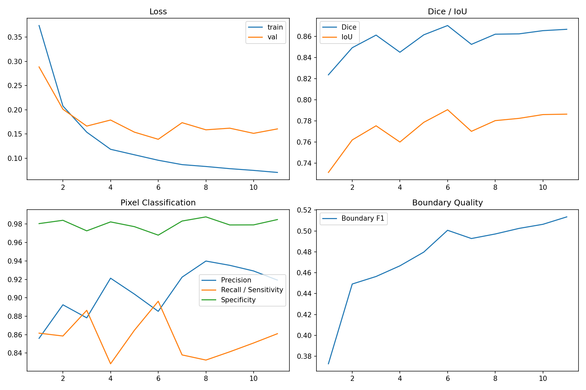
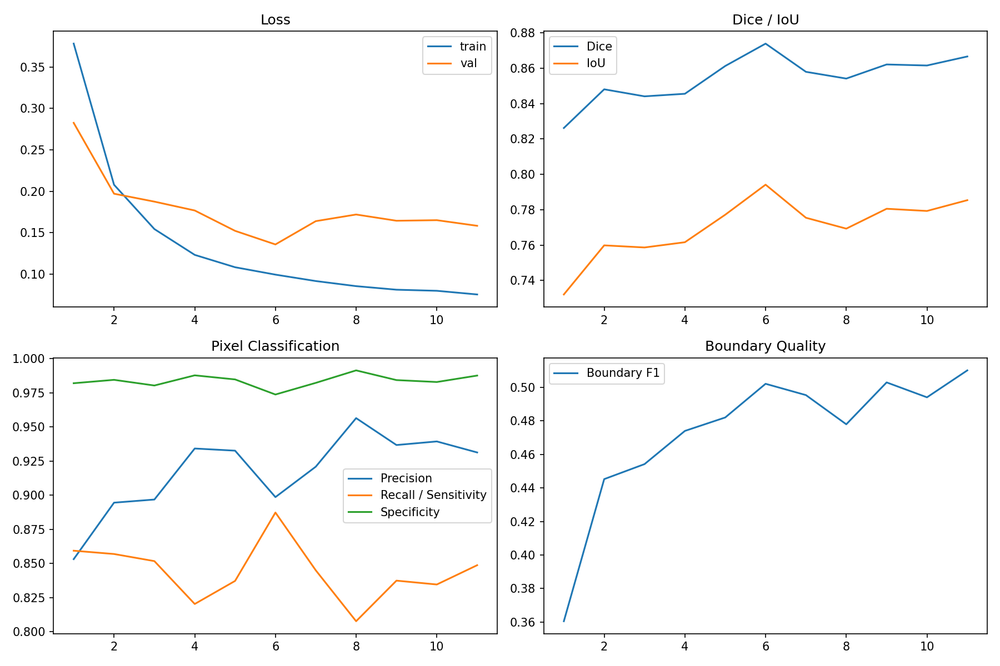
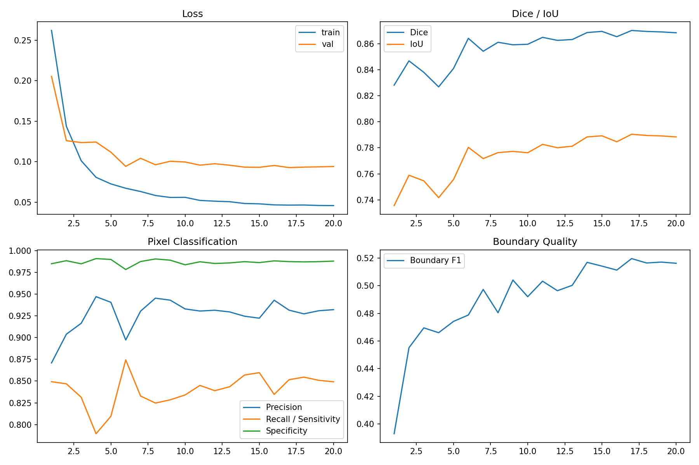
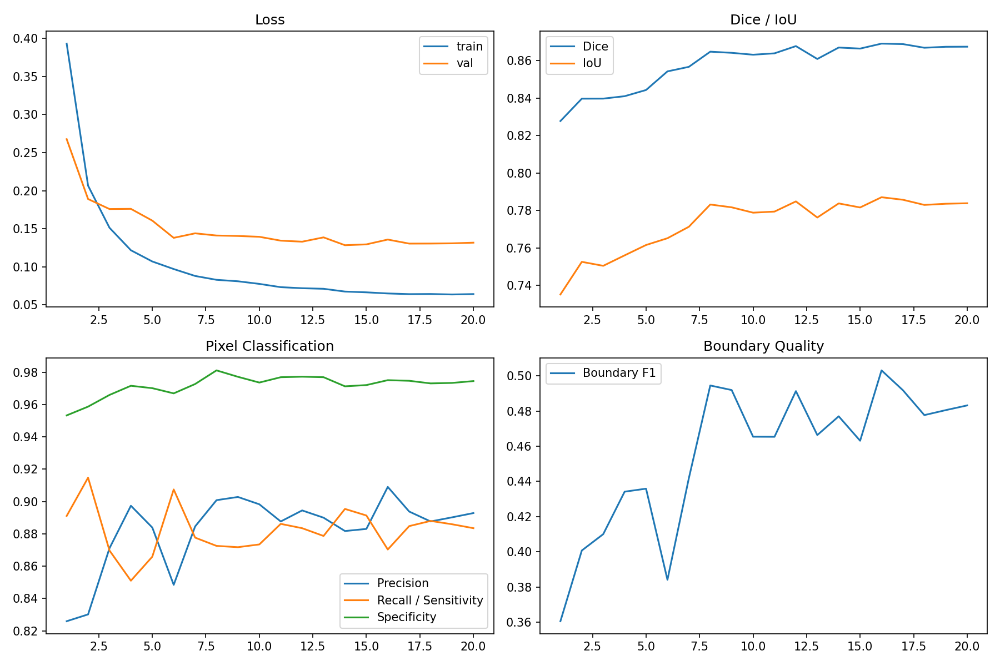

# v1.3 Low-Contrast Variant Curves / 低对比度变体训练曲线

## Control BCE + Dice

[Training history CSV](../assets/experiments/v1.3/variants/control_bce_dice/outputs/training_history.csv)

## Contrast Augmentation + BCE + Dice

[Training history CSV](../assets/experiments/v1.3/variants/contrast_aug_bce_dice/outputs/training_history.csv)

## Contrast Augmentation + Focal + Dice

[Training history CSV](../assets/experiments/v1.3/variants/contrast_aug_focal_dice/outputs/training_history.csv)

## Contrast Augmentation + Tversky

[Training history CSV](../assets/experiments/v1.3/variants/contrast_aug_tversky/outputs/training_history.csv)

