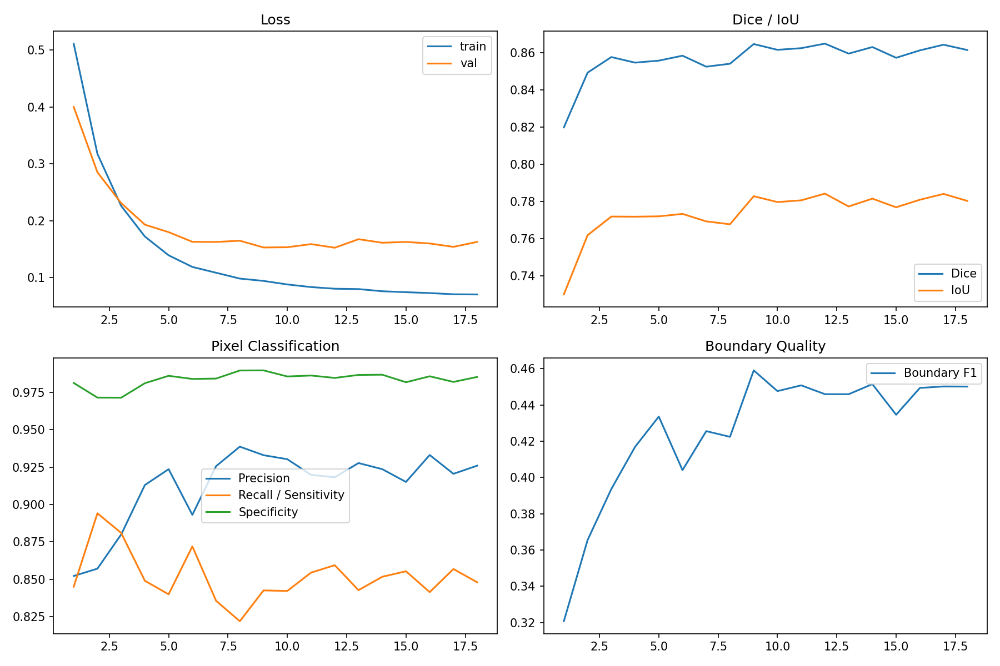
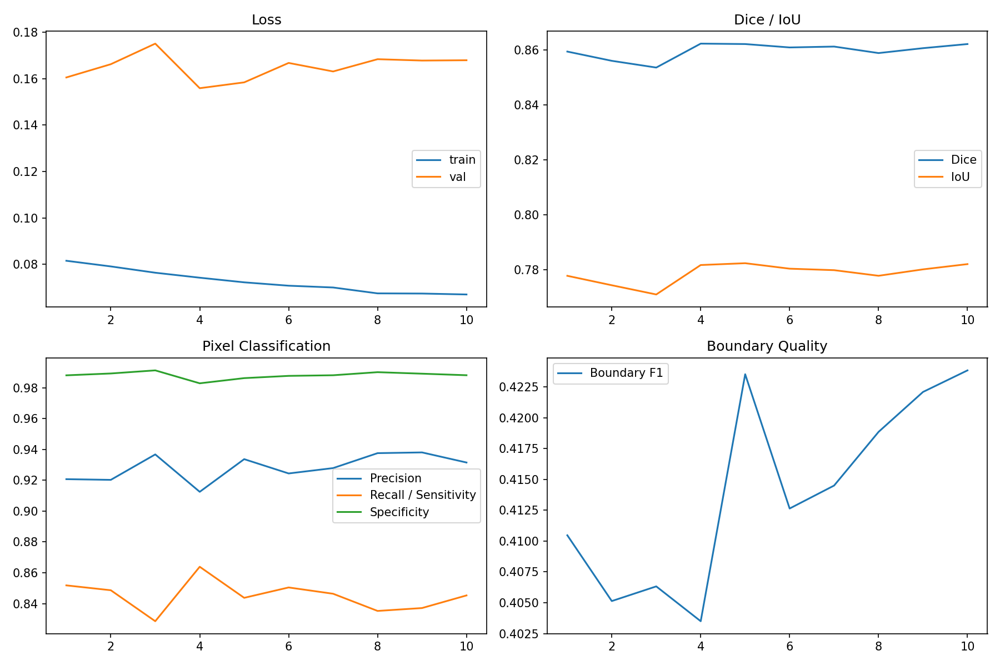
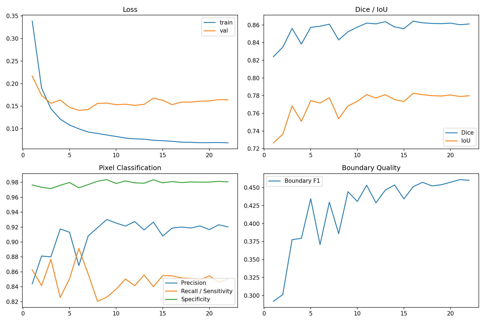
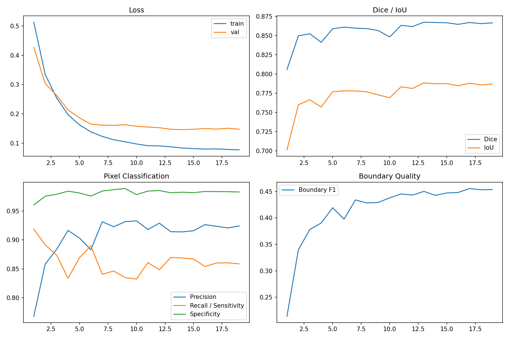

# v1.4 Aggressive Candidate Curves / 激进候选训练曲线

## U-Net++ EfficientNet-B4 448

[Raw metrics CSV](../assets/experiments/v1.4/experiments/unetpp_effb4_448/outputs/metrics.csv)

## U-Net++ EfficientNet-B4 512 Fine-Tune

[Raw metrics CSV](../assets/experiments/v1.4/experiments/unetpp_effb4_512_finetune/outputs/metrics.csv)

## DeepLabV3+ EfficientNet-B4 448

[Raw metrics CSV](../assets/experiments/v1.4/experiments/deeplabv3plus_effb4_448/outputs/metrics.csv)

## U-Net++ EfficientNet-B5 448

[Raw metrics CSV](../assets/experiments/v1.4/experiments/unetpp_effb5_448/outputs/metrics.csv)

