# v1.5 Multi-Stage Training Curves / 多阶段训练曲线

Every screening, teacher, and student run from the completed v1.5 pipeline is listed below. The final selection and evaluation are preserved as [locked decision JSON](../assets/experiments/v1.5/selection/locked_decision.json) and [evaluation JSON](../assets/experiments/v1.5/final/evaluation_complete.json).

## Architecture Screening

### `screen-manet-fold0`

[Raw metrics CSV](../assets/experiments/v1.5/models/screen-manet-fold0/outputs/metrics.csv)

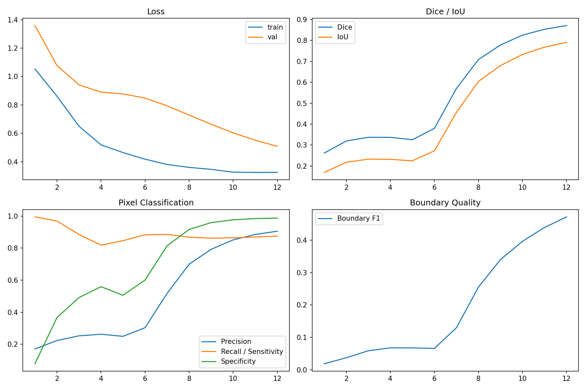

### `screen-segformer-fold0`

[Raw metrics CSV](../assets/experiments/v1.5/models/screen-segformer-fold0/outputs/metrics.csv)

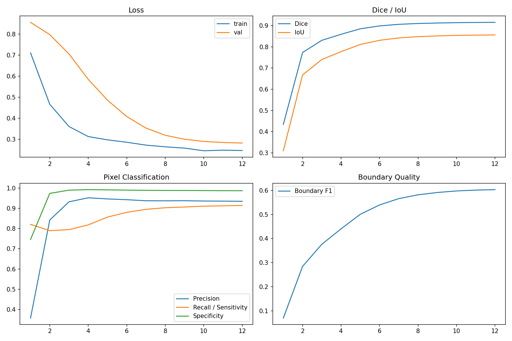

### `screen-unetpp-fold0`

[Raw metrics CSV](../assets/experiments/v1.5/models/screen-unetpp-fold0/outputs/metrics.csv)

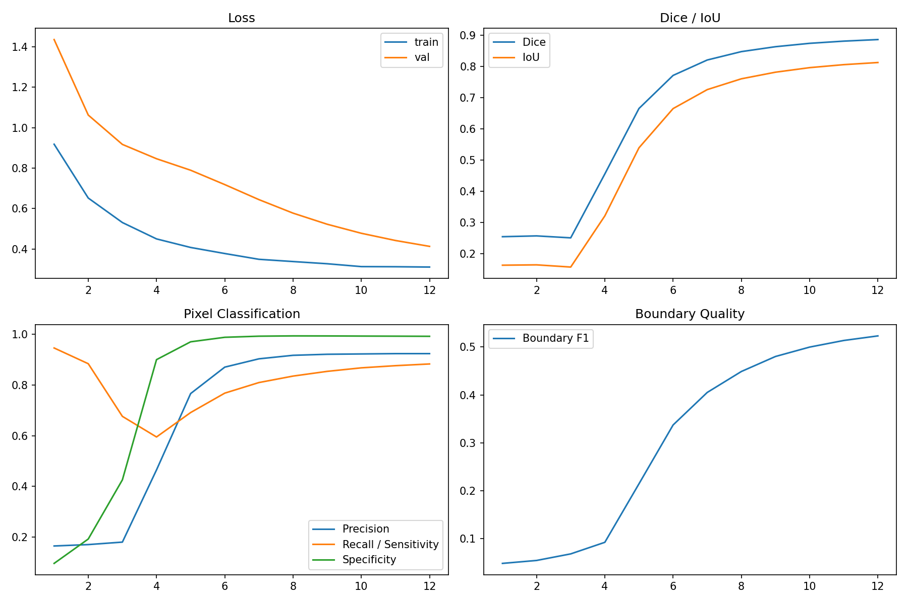

## U-Net++ Teachers

### `teacher-unetpp-fold0`

[Raw metrics CSV](../assets/experiments/v1.5/models/teacher-unetpp-fold0/outputs/metrics.csv)

### `teacher-unetpp-fold1`

[Raw metrics CSV](../assets/experiments/v1.5/models/teacher-unetpp-fold1/outputs/metrics.csv)

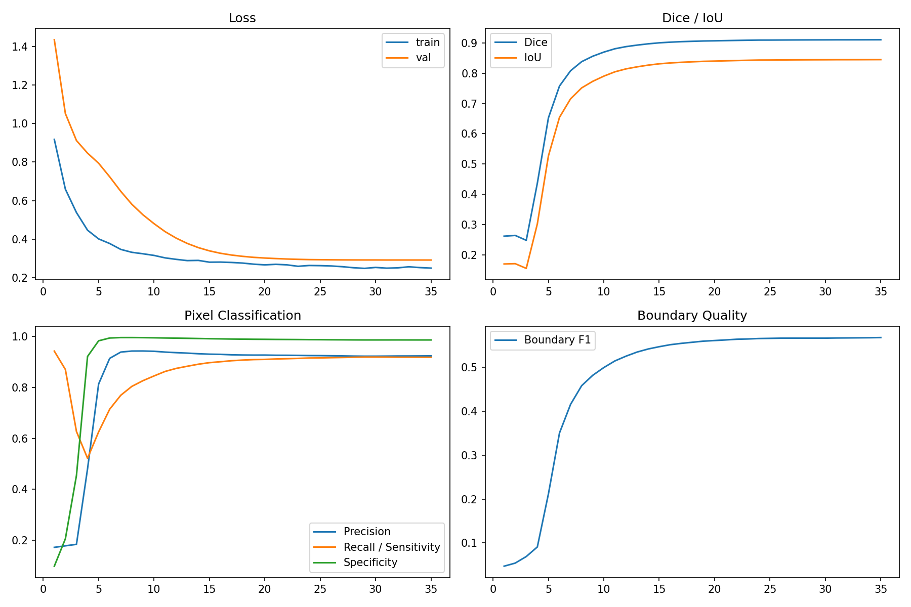

### `teacher-unetpp-fold2`

[Raw metrics CSV](../assets/experiments/v1.5/models/teacher-unetpp-fold2/outputs/metrics.csv)

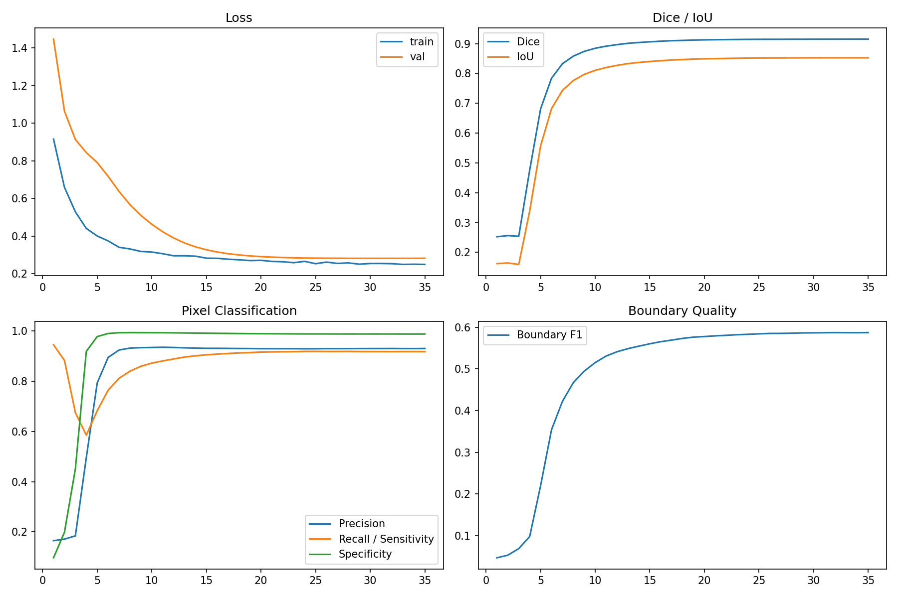

### `teacher-unetpp-fold3`

[Raw metrics CSV](../assets/experiments/v1.5/models/teacher-unetpp-fold3/outputs/metrics.csv)

### `teacher-unetpp-fold4`

[Raw metrics CSV](../assets/experiments/v1.5/models/teacher-unetpp-fold4/outputs/metrics.csv)

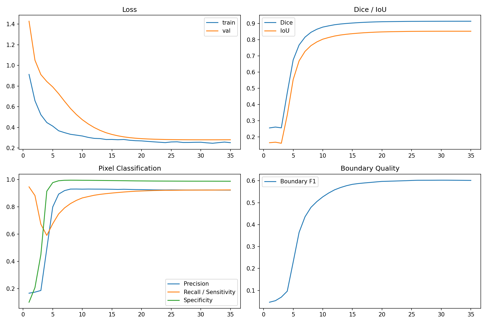

## SegFormer Teachers

### `teacher-segformer-fold0`

[Raw metrics CSV](../assets/experiments/v1.5/models/teacher-segformer-fold0/outputs/metrics.csv)

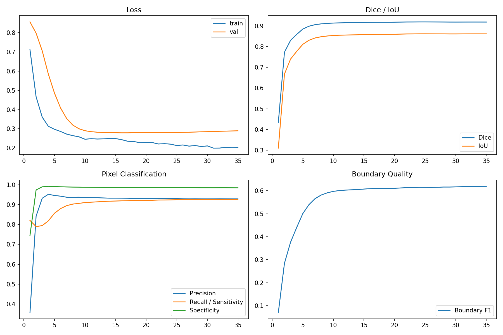

### `teacher-segformer-fold1`

[Raw metrics CSV](../assets/experiments/v1.5/models/teacher-segformer-fold1/outputs/metrics.csv)

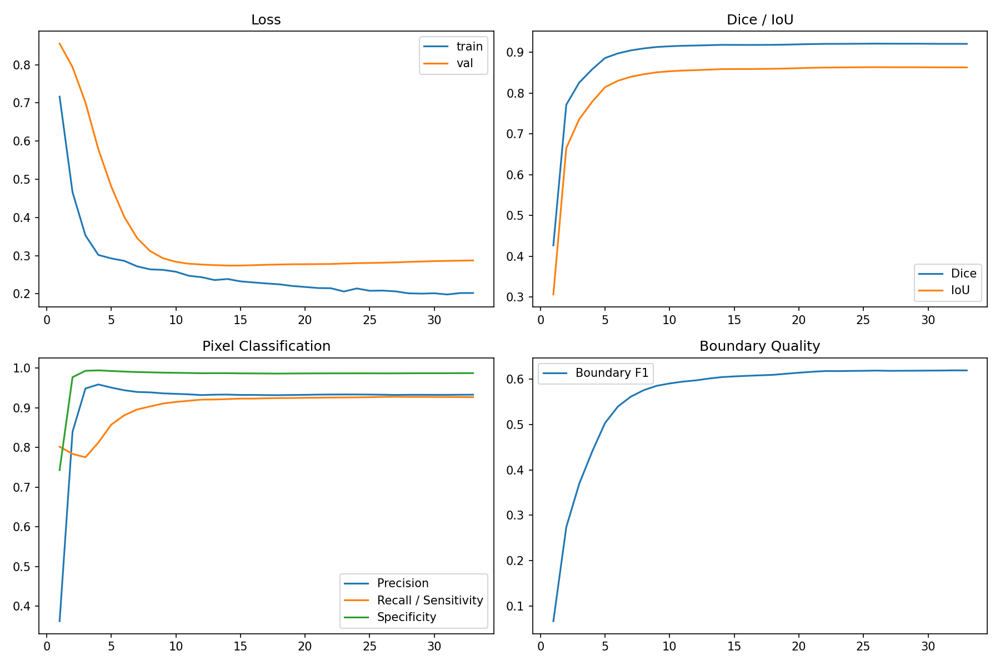

### `teacher-segformer-fold2`

[Raw metrics CSV](../assets/experiments/v1.5/models/teacher-segformer-fold2/outputs/metrics.csv)

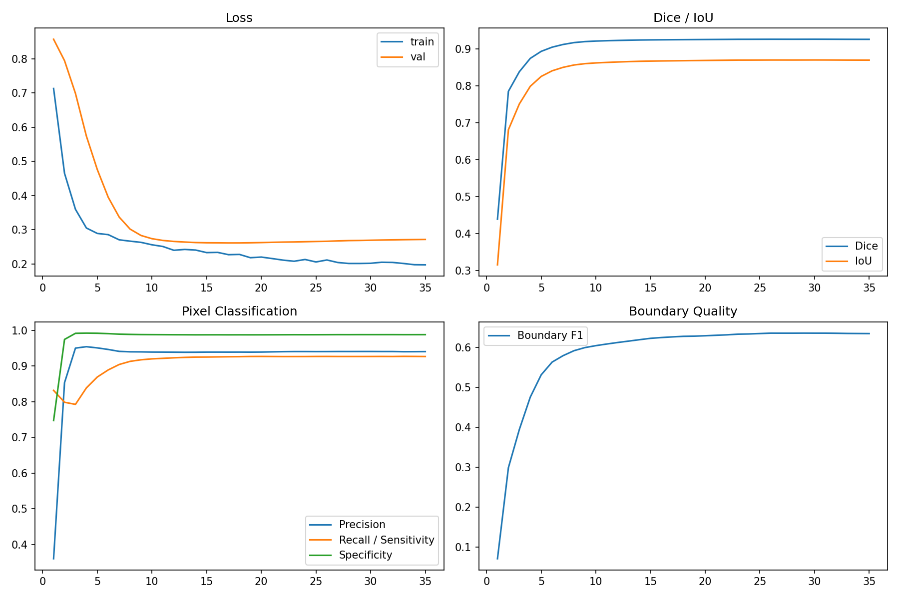

### `teacher-segformer-fold3`

[Raw metrics CSV](../assets/experiments/v1.5/models/teacher-segformer-fold3/outputs/metrics.csv)

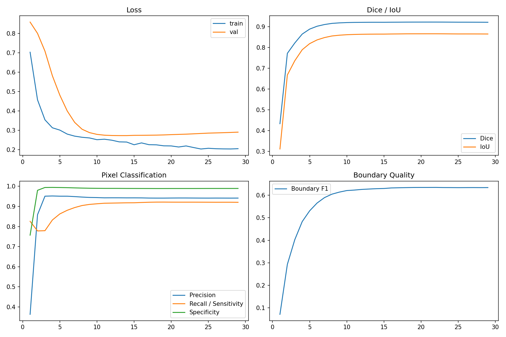

### `teacher-segformer-fold4`

[Raw metrics CSV](../assets/experiments/v1.5/models/teacher-segformer-fold4/outputs/metrics.csv)

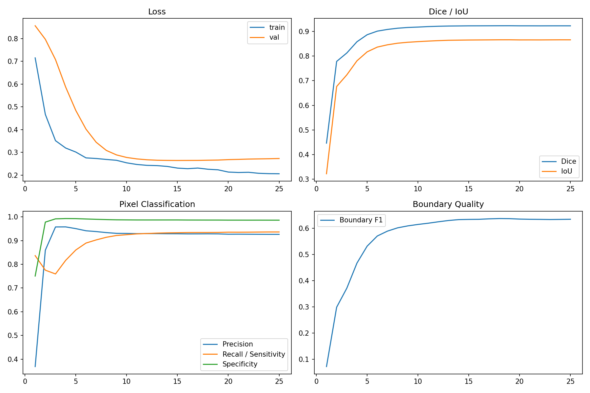

## Distilled Students

### `student-unetpp`

[Raw metrics CSV](../assets/experiments/v1.5/models/student-unetpp/outputs/metrics.csv)

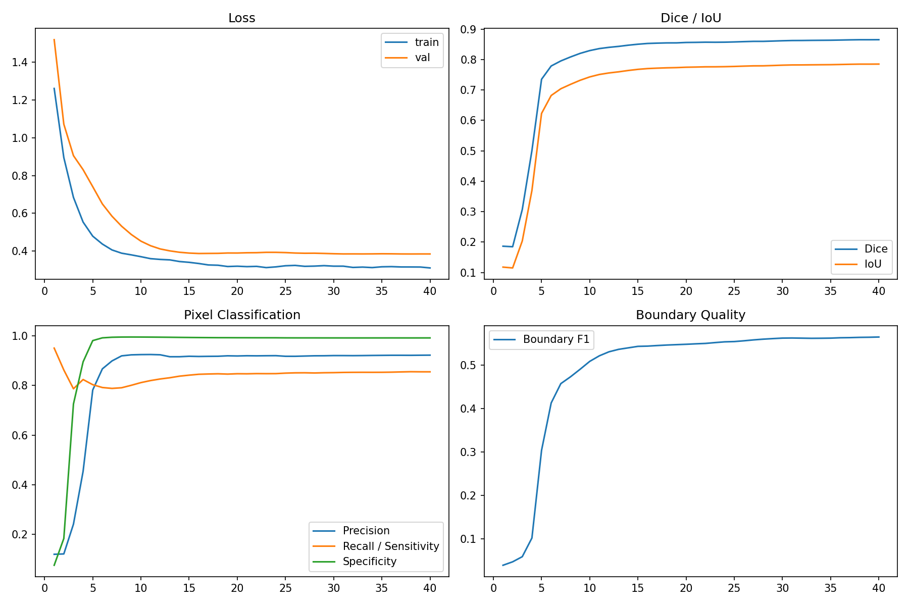

### `student-segformer`

[Raw metrics CSV](../assets/experiments/v1.5/models/student-segformer/outputs/metrics.csv)

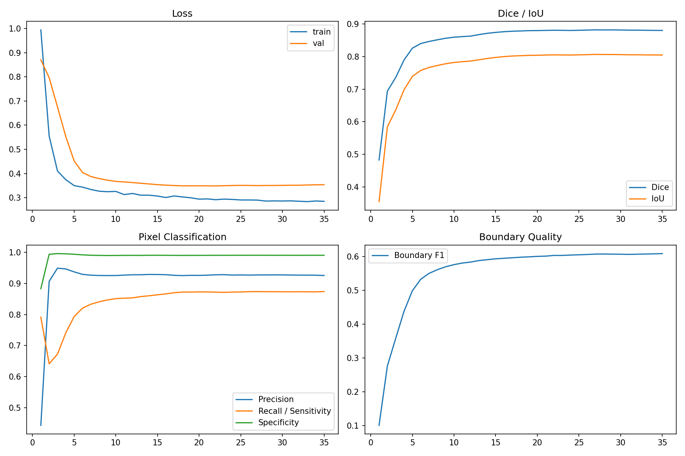

