# v1.6 Target-Domain Training Curves / 目标域训练曲线

Every HAM10000 pretraining, target-domain teacher, and confidence-gated student run from v1.6 is listed below. The locked ten-teacher decision and one-time final evaluation are preserved as [locked decision JSON](../assets/experiments/v1.6/selection/locked_decision.json) and [evaluation JSON](../assets/experiments/v1.6/final/evaluation_complete.json).

The teacher CSV files contain the persisted target-adaptation stage available in the final resumable state. No missing epochs are reconstructed or inferred.

## HAM10000 Pretraining

### `pretrain-unetpp`

[Raw metrics CSV](../assets/experiments/v1.6/models/pretrain-unetpp/outputs/metrics.csv)

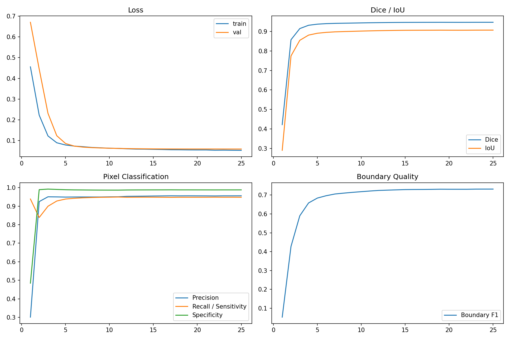

### `pretrain-segformer`

[Raw metrics CSV](../assets/experiments/v1.6/models/pretrain-segformer/outputs/metrics.csv)

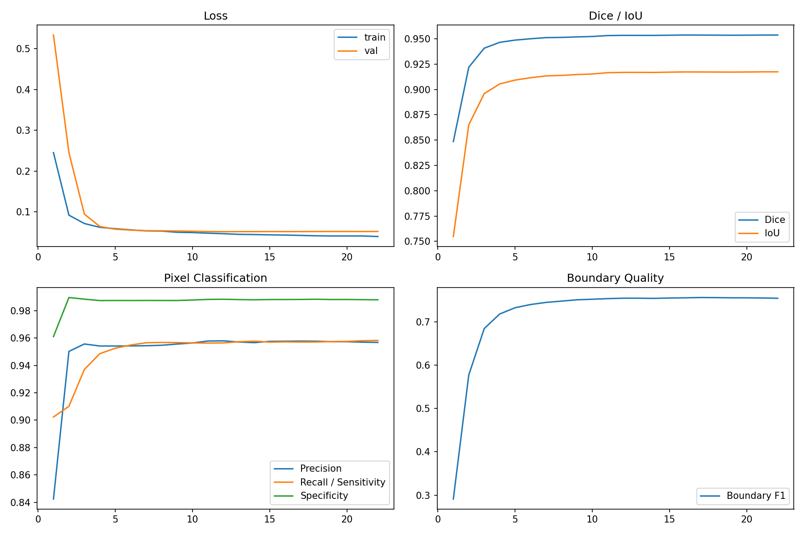

## U-Net++ Teachers

### `teacher-unetpp-fold0`

[Raw metrics CSV](../assets/experiments/v1.6/models/teacher-unetpp-fold0/outputs/metrics.csv)

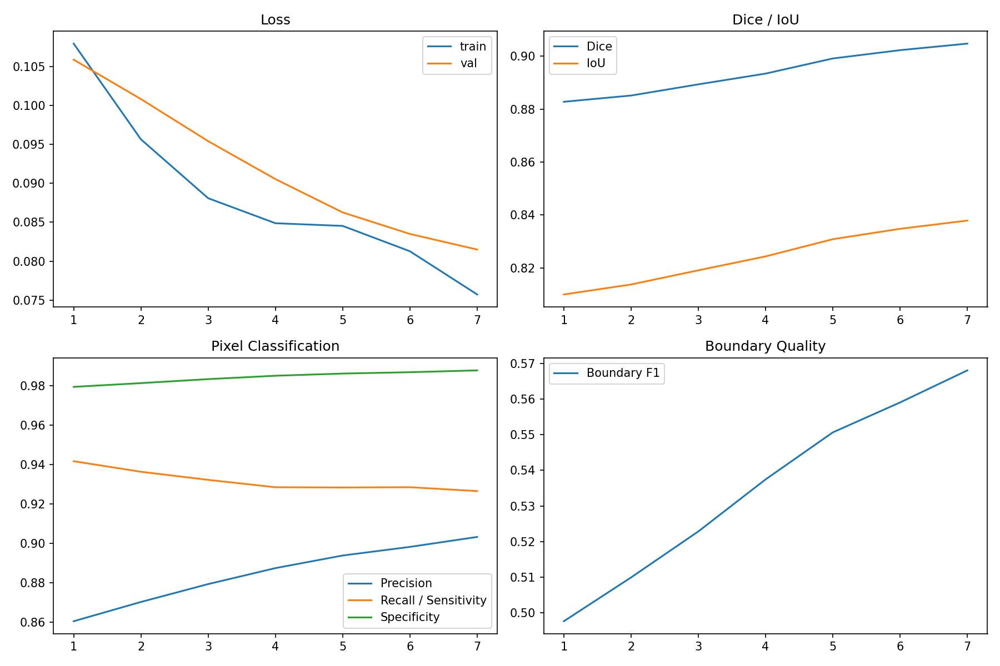

### `teacher-unetpp-fold1`

[Raw metrics CSV](../assets/experiments/v1.6/models/teacher-unetpp-fold1/outputs/metrics.csv)

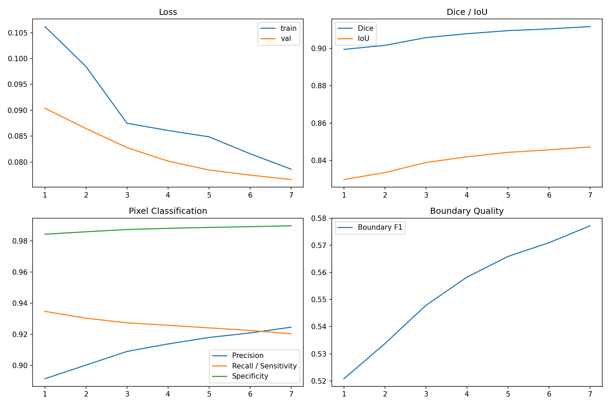

### `teacher-unetpp-fold2`

[Raw metrics CSV](../assets/experiments/v1.6/models/teacher-unetpp-fold2/outputs/metrics.csv)

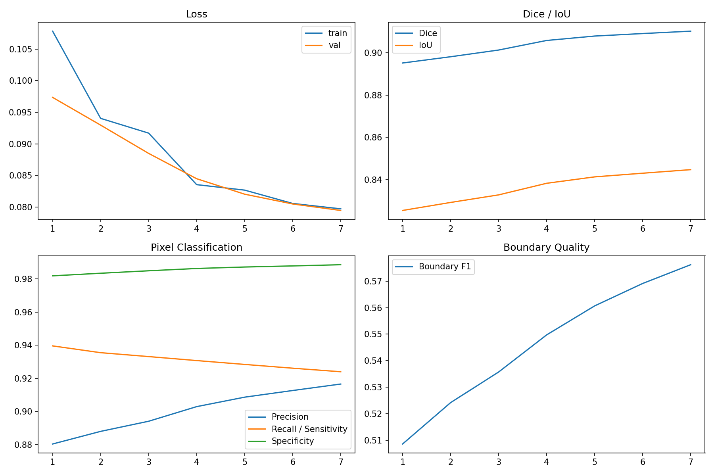

### `teacher-unetpp-fold3`

[Raw metrics CSV](../assets/experiments/v1.6/models/teacher-unetpp-fold3/outputs/metrics.csv)

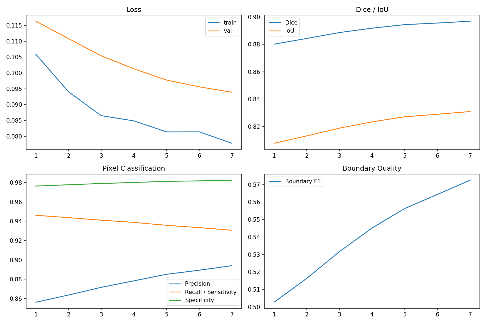

### `teacher-unetpp-fold4`

[Raw metrics CSV](../assets/experiments/v1.6/models/teacher-unetpp-fold4/outputs/metrics.csv)

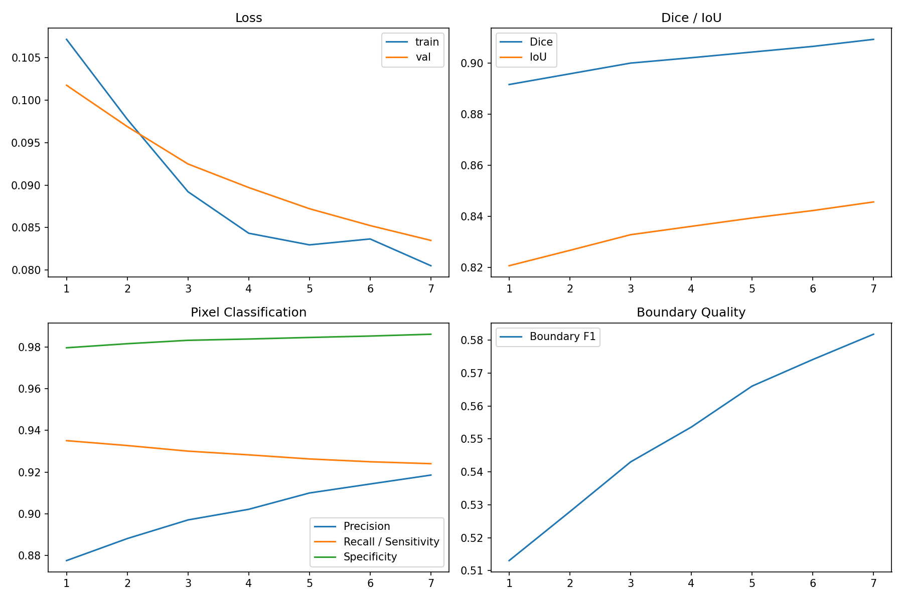

## SegFormer Teachers

### `teacher-segformer-fold0`

[Raw metrics CSV](../assets/experiments/v1.6/models/teacher-segformer-fold0/outputs/metrics.csv)

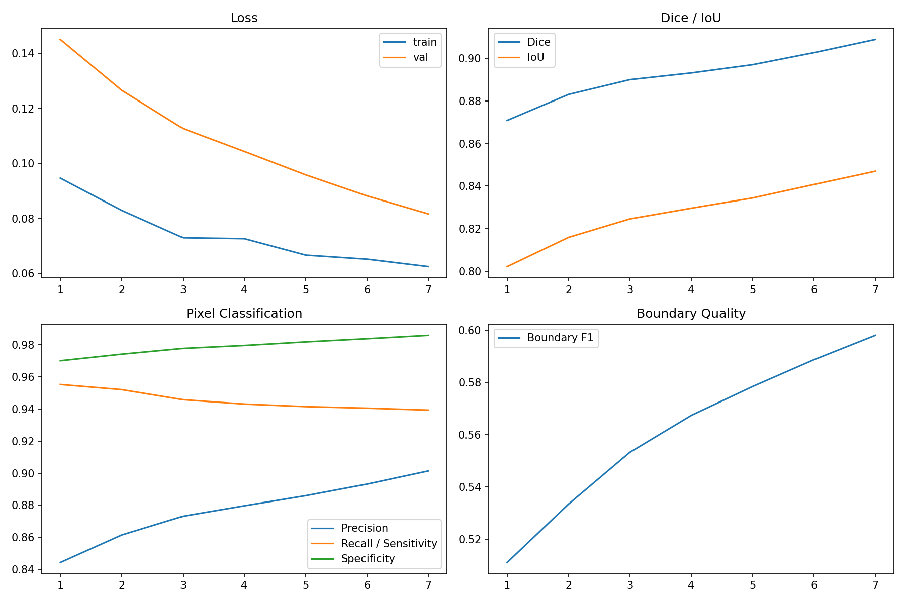

### `teacher-segformer-fold1`

[Raw metrics CSV](../assets/experiments/v1.6/models/teacher-segformer-fold1/outputs/metrics.csv)

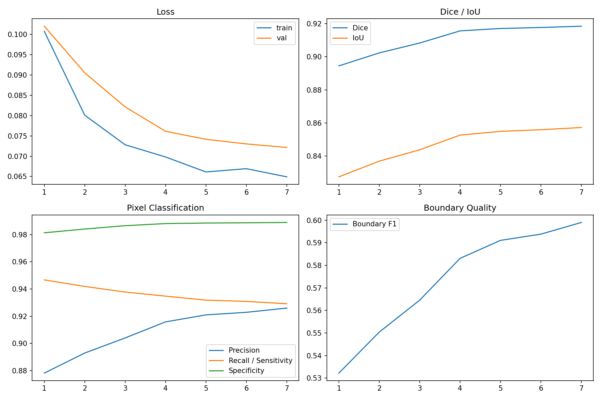

### `teacher-segformer-fold2`

[Raw metrics CSV](../assets/experiments/v1.6/models/teacher-segformer-fold2/outputs/metrics.csv)

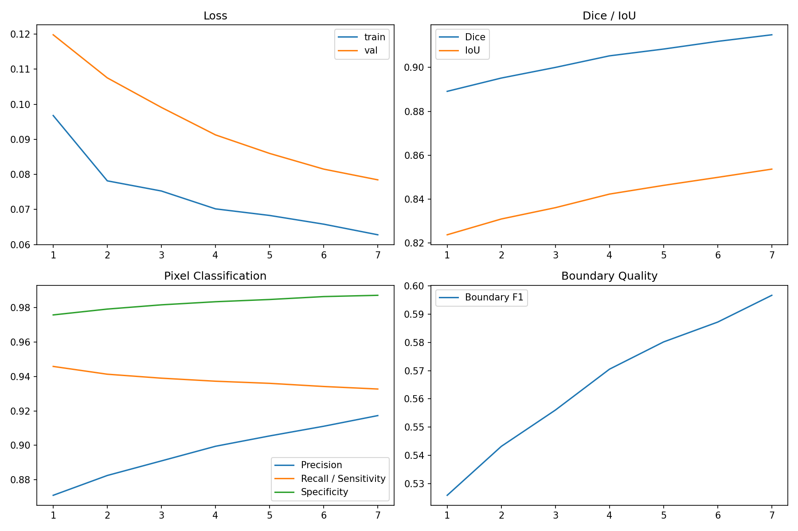

### `teacher-segformer-fold3`

[Raw metrics CSV](../assets/experiments/v1.6/models/teacher-segformer-fold3/outputs/metrics.csv)

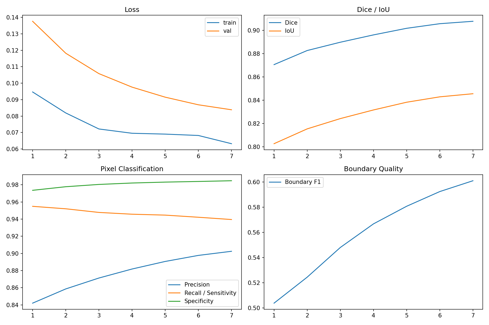

### `teacher-segformer-fold4`

[Raw metrics CSV](../assets/experiments/v1.6/models/teacher-segformer-fold4/outputs/metrics.csv)

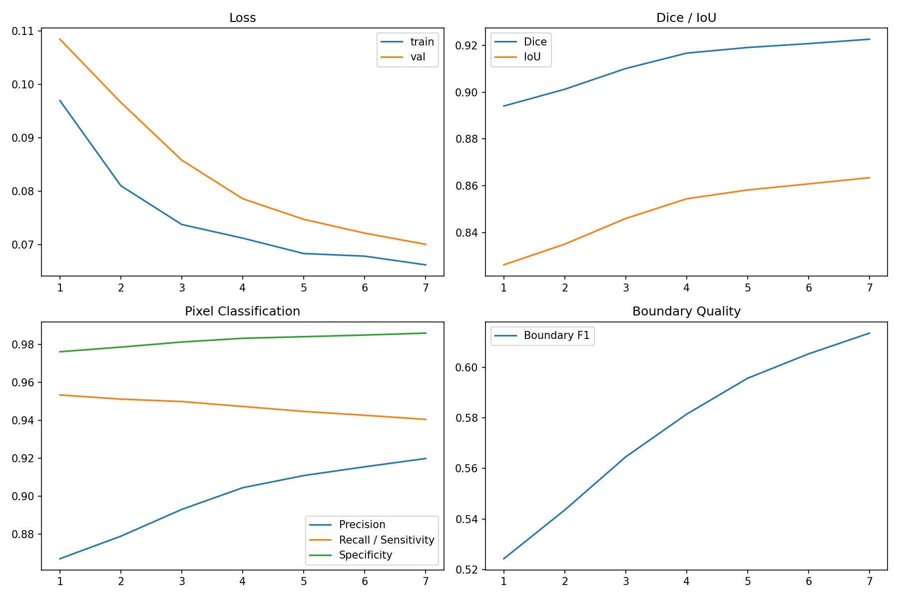

## Confidence-Gated Students

### `student-unetpp`

[Raw metrics CSV](../assets/experiments/v1.6/models/student-unetpp/outputs/metrics.csv)

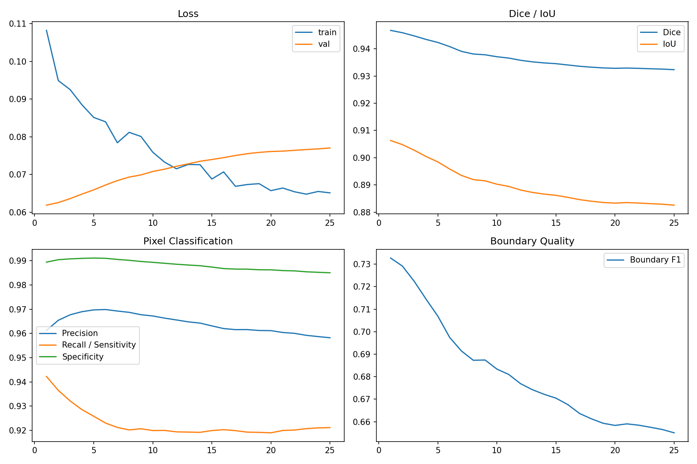

### `student-segformer`

[Raw metrics CSV](../assets/experiments/v1.6/models/student-segformer/outputs/metrics.csv)

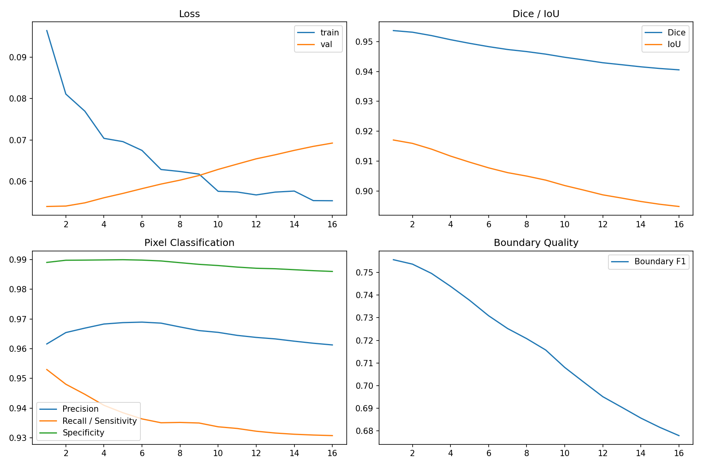

